# 03 — System Design Document (Architecture Specification)

| Field | Value |
|---|---|
| Document Name | System Design / Architecture Specification |
| Version | 1.0 |
| Status | Baseline for Phase 1 build |
| Date | 2026-09-27 |
| Owner | Engineering Lead (AI sections with AI Lead) |
| Purpose | Describes **how** the system works: components, data, AI pipeline, HITL, tenancy, APIs, events, flows, security, monitoring and deployment, so an engineering team can start implementation. |
| Source Research | TRD and PRD decisions; S06 (pipeline/cascade patterns), S07 (grounding, templates, risk), S09 (HITL), S10 (PII isolation), S11 (state machine) |
| Dependencies | `01-PRD.md`, `02-TRD.md`, `06`, `07`, `08`, `10-registers.md` |

---

## 1. Architecture Overview

### 1.1 System context

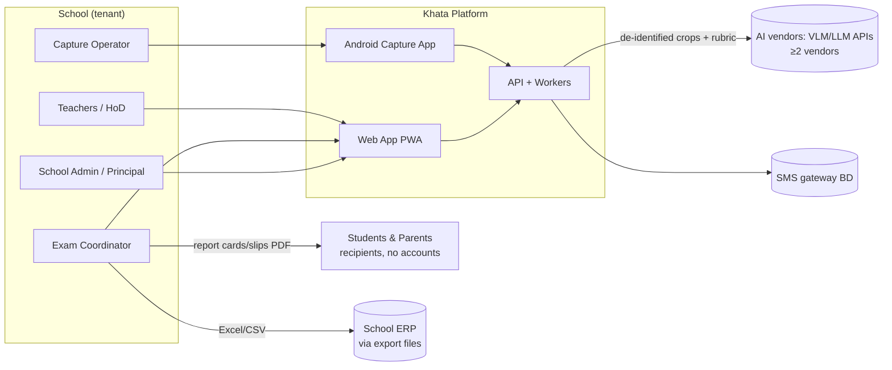

### 1.2 Containers

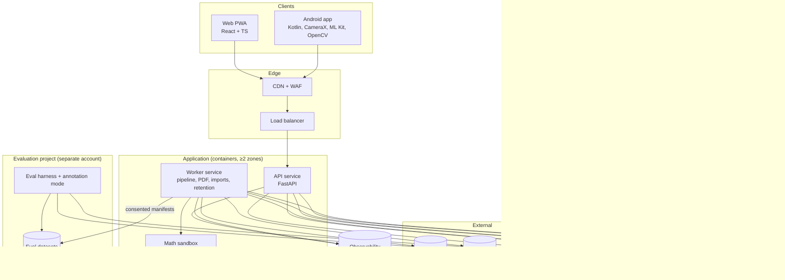

**Why this shape** (DEC-11):
- one codebase and two process types (API, worker);
- PostgreSQL is both the system of record and the job queue;
- object storage holds images;
- the maths sandbox is a separate process pool for isolation;
- the evaluation harness is physically separate so gold data never mixes with production.

---

## 2. Component Architecture (modules inside the monolith)

| Module | Responsibilities | Key entities | Talks to |
|---|---|---|---|
| `identity` | Staff auth, OTP, sessions, devices | User, Device, Session | notification |
| `org` | Organisations, schools, years, classes, groups, sections, staff roles, teaching assignments | Organization, School, Section, RoleAssignment | identity |
| `roster` | Students (identity schema), enrolments, consent, imports (Bijoy conversion) | Student, Enrollment, Consent | org |
| `curriculum` | Curriculum packs, templates, item-type rules | CurriculumVersion, PaperTemplate | — |
| `exams` | Exams, papers, questions, items, MCQ keys, lifecycle state machine, cover-sheet generation | Exam, Question, Item, CoverSlot | curriculum, rubrics, reporting |
| `rubrics` | Rubric versions, criteria, model answers, alternatives, answer specs, templates, validation, lock | RubricVersion, Criterion | knowledge |
| `capture` | Capture sessions, scripts, pages, uploads, PDF import, attendance | Script, Page | exams, roster |
| `pipeline` | Processing DAG, jobs, image QA, classification, OMR, mapping, AI dispatch, verification, risk, suggestion assembly | Region, ItemResponse, Suggestion, Job | ai-gateway, mathcheck, knowledge |
| `ai-gateway` | Provider abstraction, prompt rendering, routing, budgets, batch submit/collect, cost accounting, kill switches | PromptVersion, ModelRoute, ProviderCall | metering |
| `mathcheck` | Numeric, unit, expression, equation, step checks (sandboxed) | — | — |
| `review` | Queues, leases, review cards, decisions, masking, batch confirm (L3), telemetry | Decision, CriterionDecision, Flag | knowledge, audit |
| `knowledge` | Clarifications, alternatives, exception rules, instructions, precedence resolver, re-suggestion triggers | KnowledgeArtifact | pipeline |
| `moderation` | Samples, blind re-marks, reports | ModerationSample | review |
| `results` | Aggregation, pass rules, grades, GPA, result sets and versions, imports of other marks | ComponentMark, ResultSet | exams |
| `reporting` | PDFs (covers, report cards, slips, ledgers), Excel/CSV exports | ReportJob | results |
| `rechecks` | Re-check requests, assignment, outcomes | RecheckRequest | review, results |
| `analytics` | Progress, item analysis, school AI view | (read models) | all (read) |
| `aiq` | Capability registry, gate reports, monitors, demotion hooks | CapabilityCell, GateReport | eval harness |
| `metering` | Meter events, allowances, usage, invoices (manual payments) | MeterEvent, Plan | — |
| `audit` | Append-only audit events, hash chain, viewer | AuditEvent | all |
| `privacy` | Retention jobs, data requests, deletion certificates | DataRequest | all |
| `admin` | Settings, support grants, feature flags | Setting, SupportGrant | — |

---

## 3. Service Architecture

| Service | Runtime | Scaling | Notes |
|---|---|---|---|
| API service | FastAPI (uvicorn), stateless | Horizontal, ≥2 instances in 2 zones | Serves web and Android. Signed URLs for media. |
| Worker service | Same image; queue consumers per lane | Autoscale by queue age per lane | Lanes: `priority`, `standard`, `batch-submit`, `batch-collect`, `pdf`, `import`, `maintenance` |
| Math sandbox | Separate process pool (container) with no network | Fixed small pool, scale with CPU | Timeouts 2 s per check |
| Scheduler | Cron-like jobs (in worker) | Single leader (DB advisory lock) | Batch cut-off 22:00, retention, monitors, chain anchoring |
| Web PWA | Static assets via CDN | CDN | — |
| Android app | Device | — | Offline-first |
| Eval harness | Separate project; batch jobs | On demand | Reads only eval datasets |

---

## 4. Data Architecture

| Store | Contents | Encryption | Access |
|---|---|---|---|
| PostgreSQL `public` schema (RLS) | Tenancy, exams, rubrics, items, suggestions, decisions, results, knowledge, metering, audit | Managed at-rest + TLS | App role (RLS enforced) |
| PostgreSQL `identity` schema | Student names, rolls, consent evidence references | Column encryption with per-tenant DEK (envelope via KMS) | Identity service functions only |
| Object storage `scripts/` | Page originals + normalised, crops | SSE with per-tenant keys | Signed URLs (≤5 min), app role |
| Object storage `reports/` | Generated PDFs, exports | Per-tenant keys | Signed URLs |
| Object storage `ai-archive/` | Raw AI outputs (encrypted), for audit | Per-tenant keys | Audit/AIQ only |
| Eval project | Dataset manifests, de-identified crops, labels, evaluation runs | Separate KMS | Platform AIQ/assessment roles |
| Analytics store | Event metrics without content or identity | Standard | Platform |

**Identity separation.** Content tables reference `student_uid` (a random UUID). Joins to names happen only in the identity service for display, reports and exports, within the requester's scope.

---

## 5. AI Architecture

Detailed in `06` §2. System view:

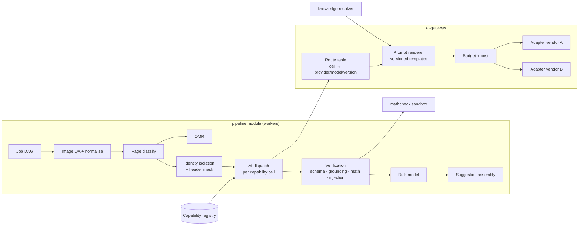

**Key design choices:**
- **Dispatch checks** the capability level, consent (CT-2) and kill switches before any provider call (TR-AI-01, TR-AI-09).
- **Batch mode:** the dispatcher writes provider requests to a batch staging table. `batch-submit` sends vendor batches at the cut-off. `batch-collect` polls and resumes the DAG.
- **Second opinion** is triggered after the first verification and risk features, within budget (TR-AI-05).
- **Provenance** is written atomically with each suggestion (TR-AI-07).

---

## 6. Multi-tenant Architecture (DEC-38)

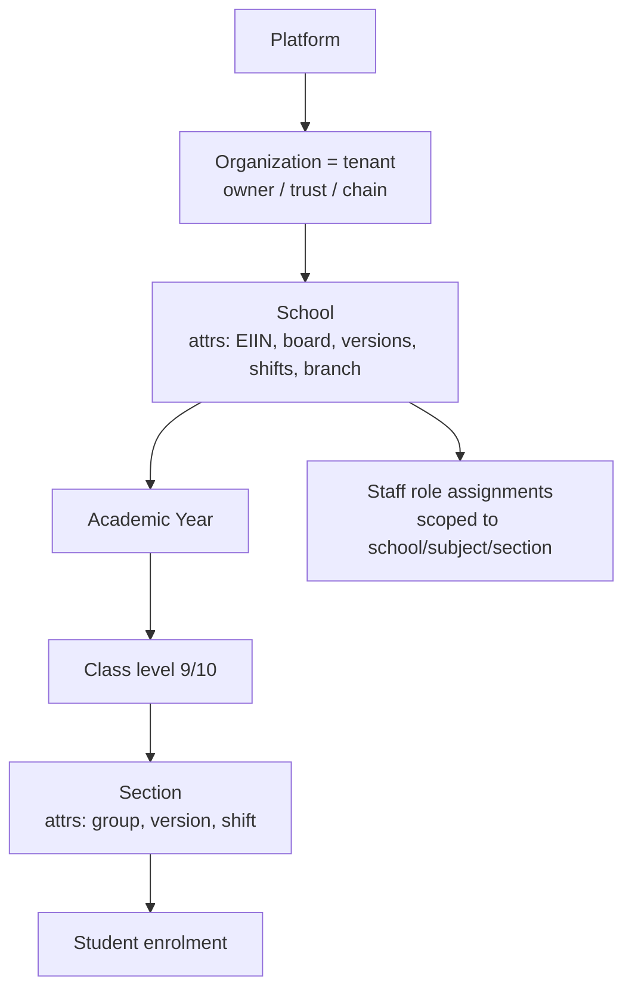

- **Tenant = Organisation.** A single-school customer is an organisation with one school. Branches, shifts and versions are **attributes**, not tiers. This avoids a rigid "campus" layer; S11's proposed deeper hierarchy was simplified.
- `tenant_id` on all tenant-owned rows. PostgreSQL RLS policy `tenant_id = current_setting('app.tenant_id')`. The app sets it per request from the token. School, subject and section scopes are enforced in the policy module with an additional RLS on section-scoped tables.
- Per-tenant data encryption keys (identity schema, object storage).
- Platform-global data: curriculum packs, platform templates, prompt versions, model routes, capability registry (not tenant-owned).
- Knowledge artefacts carry `tenant_id` + scope. The resolver never crosses tenants.

---

## 7. Database Design

### 7.1 Organisation, roster and curriculum

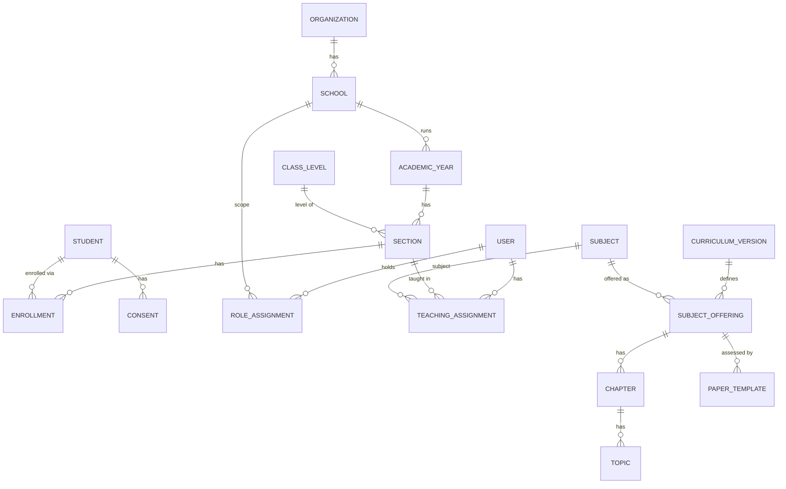

| Entity | Key fields | Notes |
|---|---|---|
| Organization | id (tenant_id), name, plan_id, status | Tenant root |
| School | id, tenant_id, names (bn/en), eiin?, board, versions[], shifts[], settings_id | |
| AcademicYear | id, school_id, year, start/end | |
| ClassLevel | code (6..12) | Global |
| Section | id, academic_year_id, class_level, group (science/humanities/business/none), version (BM/EV), shift, name | |
| Student (identity schema) | student_uid, tenant_id, name_bn/en (encrypted), roll, gender? (optional, off by default) | Content tables use student_uid |
| Enrollment | student_uid, section_id, roll_no, optional_subjects (4th subject) | |
| Consent | student_uid, type (CT-1/2/3), status, evidence_ref, recorded_by, recorded_at, withdrawn_at | ≥5 yr retention |
| User | id, mobile, name, password_hash, status | Staff only |
| RoleAssignment | user_id, school_id, role, scope (subject?), valid_from/to | |
| TeachingAssignment | user_id, section_id, subject_id, academic_year_id | Drives queues |
| CurriculumVersion | id, code, academic_year, status | Global |
| Subject / SubjectOffering / Chapter / Topic | bilingual names, codes, order | Global per version |
| PaperTemplate | id, scope (platform/school), curriculum_version_id, structure JSON, pass rules, version | 08 §2.2 |

### 7.2 Exams, scripts and marking

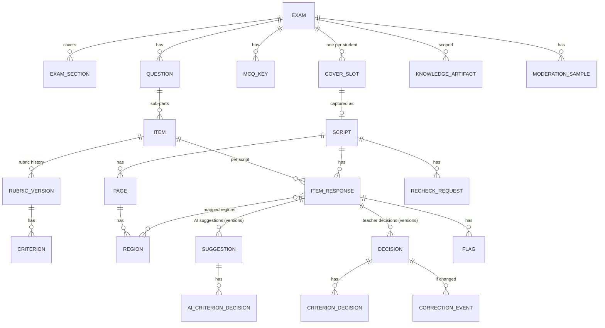

| Entity | Key fields | Notes |
|---|---|---|
| Exam | id, tenant_id, school_id, type, class_level, subject_offering_id, template_id, curriculum_version_id, date, state, processing_mode, deadlines | State machine (§14.1) |
| ExamSection | exam_id, section_id | |
| Question | id, exam_id, component (CQ/SA/MCQ), number, stimulus (rich), choice_group | |
| Item | id, question_id, part (ka/kha/ga/gha or null), label_bn/en, max_marks, cognitive_level, item_type, answer_spec JSON, capability_cell_code | Cell code = subject × item type × language derived at processing per script version |
| RubricVersion | id, item_id, version, criteria[], model_answer, alternatives[], deductions[], ecf_policy, locked_at, author | Immutable |
| Criterion | id, rubric_version_id, text_bn/en, marks, type, evidence_expectation | |
| McqKey | exam_id, set_code, question_no, correct_options[], voided | Audited changes |
| CoverSlot | id, exam_id, student_uid, script_uuid (QR), printed_at | QR carries script_uuid only |
| Script | id (=script_uuid), exam_id, student_uid, status, page_count, captured_by, device_id, submitted_at, attendance (present/absent/not_submitted) | |
| Page | id, script_id, seq, type (cover/booklet_cover/answer/blank/supplementary), object_keys, quality metrics, hashes | |
| Region | id, page_id, bbox, kind, label_text, label_parsed, legibility, flags, transcript_ref | From AI + teacher remaps |
| ItemResponse | id, script_id, item_id, region_ids[], mapping_confidence, status (item state machine, 07 §4.1), attempted, chosen_for_count (choice rules) | Central marking unit |
| Suggestion | id, item_response_id, version, level_at_time, criteria decisions, suggested_mark, risk_level, risk_reasons[], provenance_id, created_at, superseded_by | |
| Provenance | id, input hashes, rubric_version_id, prompt_version_id, knowledge_artifact_ids[], model_route_id, provider/model/version, params, raw_output_ref, validation, cost, latency | Audit core |
| Decision | id, item_response_id, version, decided_by, mark, criterion decisions, total_override?, reason_code, note, masked (bool), source (confirm/edit/manual/batch/moderation/recheck) | Latest = final |
| CorrectionEvent | id, decision_id, suggestion_id, code (C1..C12), before/after, scope, consent flags, routed_to | 07 §5 |
| Flag | id, item_response_id, kind, raised_by (teacher/AI), status, resolution | |
| KnowledgeArtifact | id, tenant_id, type (clarification/alternative/rule/instruction/template), scope (question/exam/school_subject), scope_ref, content, version, author, approved_by, expires_at | 07 §5.1 |
| ModerationSample / ModerationDecision | exam_id, marker_id, item_response_ids / moderator marks, outcome | |
| RecheckRequest | id, script_id, item_ids?, requested_via, reason, assigned_to, status, outcome, result_version_id | |

### 7.3 Results, metering, AI governance, audit

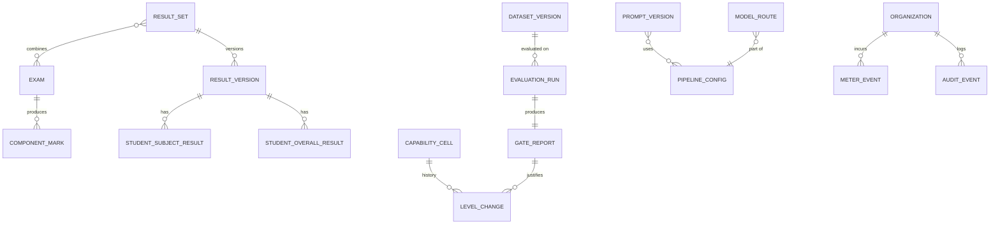

| Entity | Key fields |
|---|---|
| ComponentMark | exam_id, student_uid, component, marks, status (present/absent), source (platform/import) |
| ResultSet / ResultVersion | definition (exams + weights + policies), version, computed_at, locked, published_at, publisher |
| StudentSubjectResult / StudentOverallResult | totals per component, pass flags, grade, GP; GPA, 4th-subject adjustment |
| CapabilityCell | code (e.g., `PHY.CQ.ga.EV`), subject, item_type, script_language, current_level, pipeline_config_id |
| LevelChange | cell_id, from, to, gate_report_id, approvers[], reason, at |
| EvaluationRun / GateReport | config, dataset_version, metrics JSON with CIs, verdict, signatures |
| DatasetVersion | manifest hash, composition, consent basis |
| PromptVersion / ModelRoute / PipelineConfig / RiskModelVersion | semantic version, content hash, created_by, status |
| MeterEvent | tenant_id, exam_id, kind (page_processed, ai_call, script_ai_assisted, priority_job, sms), quantity, est_cost, billing_period |
| Plan / Allowance / Invoice / Payment | plan terms, allowance counters, invoice status, manual payment records |
| AuditEvent | id, tenant_id, seq, actor, role, action, entity, before/after (hash or value), reason, correlation_id, prev_hash, hash |
| DomainEvent | type, payload, correlation_id, created_at (outbox) |
| Job | lane, type, key, status, attempts, run_after, payload |

---

## 8. Storage Architecture

| Object | Key layout | Lifecycle |
|---|---|---|
| Page original | `scripts/{tenant}/{exam}/{script}/{page_seq}/orig.webp` | Deleted at retention (DEC-30) |
| Page normalised | `…/norm.webp` | Same |
| Item crop | `crops/{tenant}/{exam}/{item_response}.webp` | Same (regenerable) |
| AI raw output | `ai-archive/{tenant}/{yyyy}/{mm}/{provenance}.json.enc` | Same as images. The provenance summary (hashes, versions) is kept in the DB for ≥5 years. |
| Reports | `reports/{tenant}/{result_version}/...pdf` | Contract term |
| Exports | `exports/{tenant}/{job}.xlsx` | 7 days (links expire) |

- Server-side encryption with per-tenant keys; bucket policies deny public access.
- Signed GET URLs valid ≤5 minutes, issued only after an authorisation check. Images are watermarked in the viewer (user ID, time).

---

## 9. Human-in-the-Loop Architecture

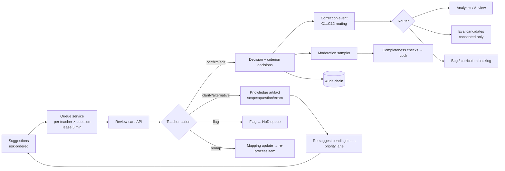

- **Masking:** the queue service marks 5% of AI-suggested items as masked when leasing. The review-card API omits the suggestion until a decision is posted, then returns it for the optional revise step.
- **L3 batch confirm:** only for items with `risk=low` in cells at L3. Batches are assembled by the queue service, with forced-open sampling.
- **Moderation** uses the same review-card API in `moderation` mode (no AI, no original mark).
- **Re-checks** use `recheck` mode (AI hidden until decision, different user enforced).

---

## 10. Assessment Architecture

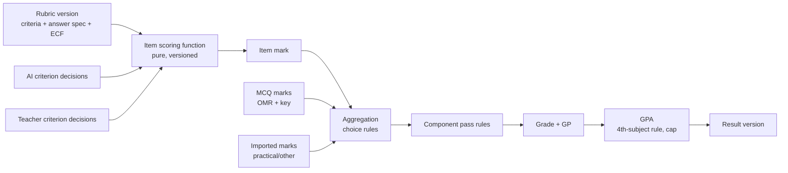

All boxes after "AI criterion decisions" are deterministic code (TR-SCO, TR-RES). **Choice-rule policy:** when a student answers more CQs than allowed, the default counts the **first N attempted in script order** (school setting: "best N"). The teacher sees which were counted in the script view.

---

## 11. Curriculum Architecture
See `08` §2. Packs are loaded through an admin import (versioned JSON). Exams pin `curriculum_version_id` and `template_id`. Cells derive the item type from template rules.

---

## 12. API Architecture

- REST `/v1`, JSON, OpenAPI 3.1, problem-details errors (TR-API).
- Auth: bearer access token (15 min) + refresh (device-bound). The tenant and scopes come from the token and are verified per request.
- Uploads: resumable chunked (tus-compatible) with per-page SHA-256.
- Long operations return `202 Accepted` + a job resource (`/v1/jobs/{id}`).

### 12.1 Endpoint catalogue (MVP)

| Area | Endpoint | Purpose | Roles |
|---|---|---|---|
| Auth | `POST /v1/auth/login` · `POST /v1/auth/otp/verify` · `POST /v1/auth/refresh` · `POST /v1/auth/logout` | Sign in, OTP, token rotation | All staff |
| Org | `GET/POST /v1/schools` · `GET/POST /v1/schools/{id}/academic-years` · `GET/POST /v1/academic-years/{id}/sections` | Structure | Admin |
| Staff | `POST /v1/schools/{id}/staff` · `PUT /v1/staff/{id}/roles` · `PUT /v1/teaching-assignments` | Users and assignments | Admin |
| Roster | `POST /v1/schools/{id}/roster-imports` (dry run) · `POST /v1/roster-imports/{id}/commit` · `GET /v1/sections/{id}/students` | Import (Bijoy→Unicode) | Admin |
| Consent | `PUT /v1/students/{uid}/consents` · `POST /v1/schools/{id}/consent-imports` · `GET /v1/schools/{id}/consent-forms.pdf` | CT-1..3 | Admin |
| Curriculum | `GET /v1/curriculum-versions` · `GET /v1/paper-templates?subject=` · `POST /v1/schools/{id}/paper-templates` | Packs, templates | Teacher, Coord |
| Exams | `POST /v1/exams` · `GET /v1/exams/{id}` · `POST /v1/exams/{id}/transitions` | Create, lifecycle | Teacher, Coord |
| Structure | `PUT /v1/exams/{id}/structure` · `POST /v1/exams/{id}/paper-extractions` (S) | Questions/items | Teacher |
| Rubrics | `PUT /v1/items/{id}/rubric-draft` · `POST /v1/exams/{id}/rubric-lock` · `POST /v1/items/{id}/rubric-versions` · `POST /v1/exams/{id}/rubric-dry-runs` (S) · `GET /v1/rubric-templates` | Rubric lifecycle | Teacher, HoD |
| MCQ | `PUT /v1/exams/{id}/mcq-keys` | Keys per set | Teacher |
| Covers | `POST /v1/exams/{id}/cover-sheets` → job → PDF | Print covers | Coord |
| Capture | `GET /v1/capture-sessions?exam=` · `POST /v1/scripts` · `POST /v1/scripts/{id}/pages` (resumable) · `PATCH /v1/scripts/{id}` (order, rotate, link student) · `POST /v1/scripts/{id}/submit` · `POST /v1/exams/{id}/pdf-imports` · `PUT /v1/exams/{id}/attendance` | Capture | Operator, Coord |
| Processing | `GET /v1/exams/{id}/processing` · `GET /v1/scripts/{id}/status` · `POST /v1/items/{id}/resuggest` · `POST /v1/item-responses/{id}/transcript` (on demand) | Status and actions | Coord, Teacher |
| Review | `GET /v1/review-queues?exam=&question=` · `POST /v1/review-queues/{id}/lease` · `GET /v1/item-responses/{id}/card` · `POST /v1/item-responses/{id}/decisions` · `POST /v1/item-responses/{id}/flags` · `POST /v1/item-responses/{id}/remap` · `POST /v1/decisions/{id}/undo` · `POST /v1/batch-confirmations` (L3) · `GET /v1/scripts/{id}/review-view` | Marking | Teacher, HoD |
| Knowledge | `POST /v1/questions/{id}/clarifications` · `POST /v1/questions/{id}/alternatives` · `POST /v1/exception-rules` (S) · `POST /v1/instructions` (S) | Scoped knowledge | Teacher, HoD |
| Moderation | `POST /v1/exams/{id}/moderation-samples` · `POST /v1/moderation-items/{id}/decisions` · `GET /v1/exams/{id}/moderation-report` | Moderation | HoD |
| Results | `POST /v1/exams/{id}/mark-imports` · `POST /v1/exams/{id}/lock` · `POST /v1/result-sets` · `GET /v1/result-sets/{id}` · `POST /v1/result-sets/{id}/publish` · `GET /v1/result-versions/{id}/tabulation?format=pdf,xlsx` · `POST /v1/result-versions/{id}/report-cards` | Results | Coord |
| Re-checks | `POST /v1/rechecks` · `POST /v1/rechecks/{id}/assign` · `POST /v1/rechecks/{id}/decision` | Appeals | Coord, HoD, Teacher |
| Analytics | `GET /v1/exams/{id}/progress` · `GET /v1/exams/{id}/item-analysis` (S) · `GET /v1/schools/{id}/ai-quality` · `GET /v1/schools/{id}/summary` (S) | Dashboards | Per role |
| Admin | `GET/PUT /v1/schools/{id}/settings` · `GET /v1/schools/{id}/usage` · `GET /v1/audit-events` · `POST /v1/data-requests` · `POST /v1/support-grants/{id}/approve` | Admin | Admin, Principal |
| Jobs | `GET /v1/jobs/{id}` | Async status | All |
| Internal (platform) | `/internal/capability-cells` · `/internal/evaluation-runs` · `/internal/gate-reports` · `/internal/prompt-versions` · `/internal/model-routes` · `/internal/curriculum-packs` · `/internal/kill-switches` | Governance | Platform roles |

**Example:** `POST /v1/item-responses/{id}/decisions`
```json
{
  "idempotency_key": "…",
  "action": "edit",
  "criteria": [{"criterion_id": "c1", "marks": 1}, {"criterion_id": "c2", "marks": 0}, {"criterion_id": "c3", "marks": 1}],
  "total_override": null,
  "reason_code": "AI_TOO_LENIENT",
  "note": "unit missing",
  "masked_first_mark": null,
  "suggestion_id": "sug_…",
  "client_ts": "2027-06-12T14:05:11+06:00"
}
```
Response: `201` with the decision, the new item state, the next-item hint and the updated script total (provisional).

---

## 13. Event Architecture

Transactional outbox in PostgreSQL. Consumers are internal modules (analytics read models, notifications, metering, aiq monitors); no external broker (DEC-11).

| Event | Emitted when | Consumers |
|---|---|---|
| `ScriptCaptured` / `PageUploaded` / `ScriptSubmitted` | Capture flow | pipeline, progress |
| `PagesNormalized` / `PageClassified` / `OmrRead` | Pipeline | progress |
| `ItemMapped` / `ItemUnmapped` | Mapper | review queues |
| `SuggestionCreated` / `SuggestionInvalid` / `RiskScored` | Pipeline | review queues, aiq |
| `ItemDecided` / `ItemFlagged` / `ItemRemapped` | Review | results, aiq, analytics, audit |
| `KnowledgeArtifactCreated` | Knowledge | pipeline (re-suggest) |
| `RubricVersionCreated` / `RubricLocked` | Rubrics | pipeline |
| `ModerationCompleted` / `MarksLocked` / `MarksUnlocked` | Moderation, results | results, notifications |
| `ResultComputed` / `ResultPublished` | Results | reporting, notifications |
| `RecheckRequested` / `RecheckDecided` | Re-checks | results |
| `ConsentChanged` | Roster | pipeline (purge pending AI outputs) |
| `CapabilityLevelChanged` / `AiMonitorBreached` | AIQ | pipeline dispatch, notifications |
| `CostThresholdExceeded` | Metering | ai-gateway (budget), ops |

---

## 14. Processing Pipelines and Flows

### 14.1 Exam lifecycle (state machine)

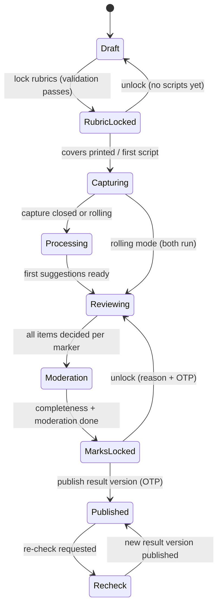

### 14.2 Data flow: exam creation and question creation

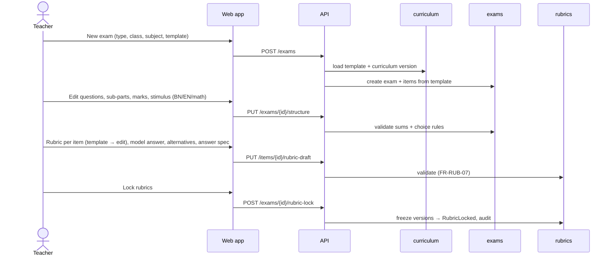

### 14.3 Data flow: paper upload (capture) and ingestion

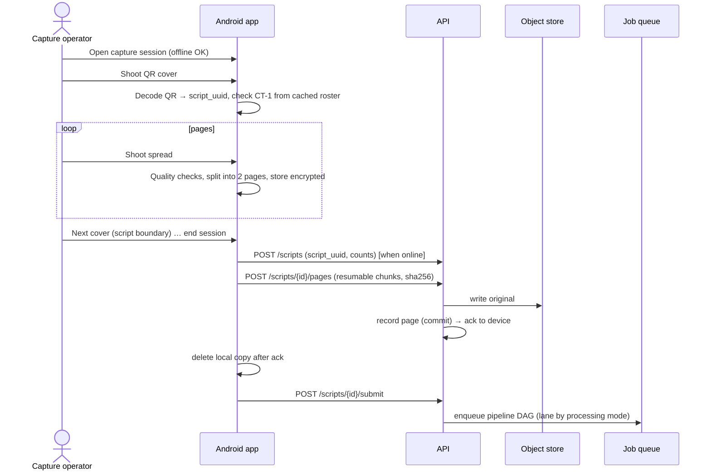

### 14.4 Data flow: OCR / answer extraction / evaluation (AI inference pipeline, standard mode)

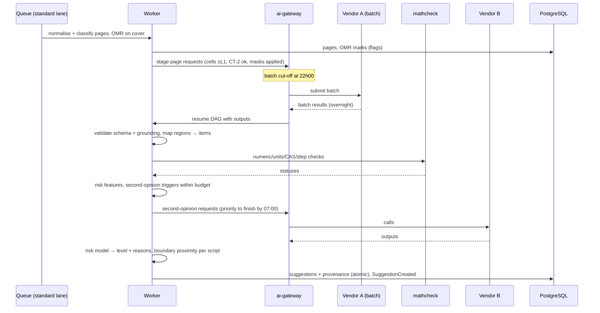

### 14.5 Data flow: human review, correction and finalisation

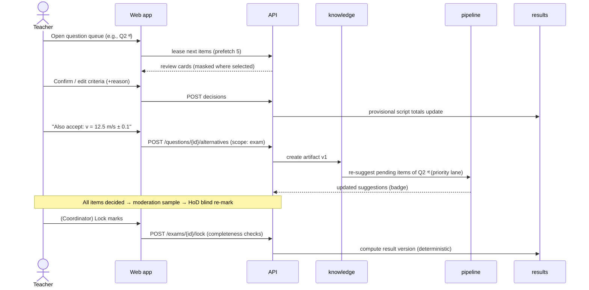

### 14.6 Data flow: feedback and result publication

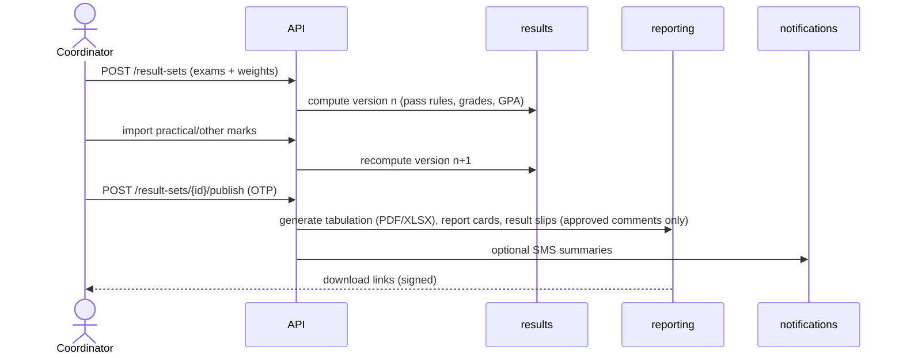

### 14.7 Data flow: analytics
Read models are updated from domain events (progress counters per exam/section/marker; item analysis after lock; school AI view aggregated daily). Cohorts <10 students are suppressed outside the teacher's own class (DATA-06). There are no raw content or identity fields in analytics tables.

### 14.8 Data flow: human correction → AI improvement

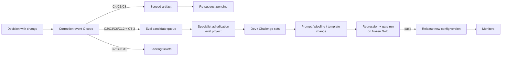

---

## 15. Evaluation Pipeline (offline)
1. Dataset manifests (GS/DS/CS/RT) in the eval project; images de-identified; consent basis recorded.
2. A candidate `PipelineConfig` (prompt versions + model routes + risk model) runs over the dataset through the **same pipeline code** in eval mode. Outputs are stored.
3. The metrics engine computes 06 §4.1 metrics with bootstrap CIs and subgroup cuts.
4. The gate engine compares with thresholds per cell → report.
5. Sign-off workflow (2 reviewers) → `LevelChange` records → capability registry updated → production dispatch reads the new levels.

---

## 16. Feedback Pipeline
- Criterion decisions (confirmed) → per-item reason snippets (from criteria text, not AI prose).
- Optional AI draft comment (FR-AI-11) generated from confirmed criteria → teacher approves → stored as approved feedback.
- The result slip combines item marks, cognitive-level totals and approved comments.

---

## 17. Security Architecture

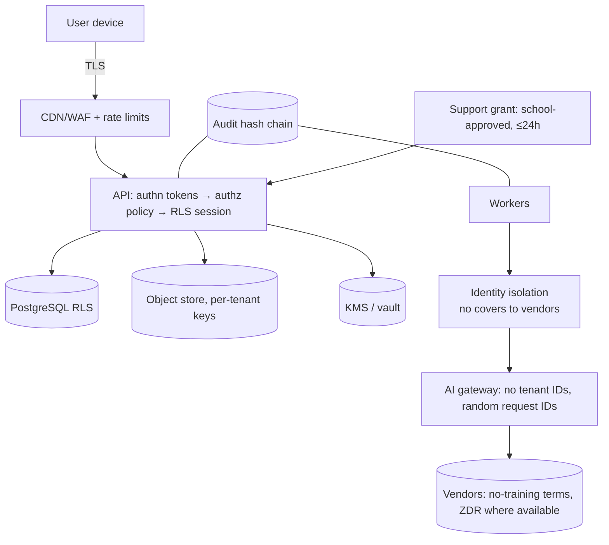

Controls are summarised in `08` §5. Key architectural points:
- two-layer authorisation (policy module + RLS);
- identity schema separation;
- per-tenant envelope encryption;
- identity isolation before AI;
- append-only audit;
- no standing staff access.

---

## 18. Monitoring Architecture

| Layer | Signals | Tooling |
|---|---|---|
| Infrastructure | CPU/mem, DB health, storage errors | Managed cloud monitoring |
| Application | Traces (OTel), request latency, error rates, queue age per lane, job failures | OTel collector → managed backend |
| Pipeline SLA | % pages ready by 07:00; priority p95 | Custom metrics |
| AI quality | Change rate, masked gap, validity, grounding failures, PSI, live-audit results, cost per page | `aiq` read models → dashboards; automatic demotion hooks |
| Security | Auth anomalies, OTP abuse, bulk exports, support grants, audit chain verification | SIEM-lite alerts |
| Business | Scripts processed, active markers, allowance consumption | Internal BI (Metabase) |

Alert routing: exam-window on-call rota; Sev-1 for any result computation discrepancy or data exposure.

---

## 19. Deployment Architecture

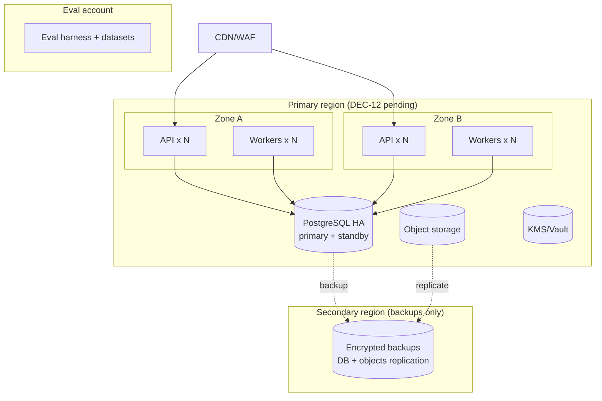

- Managed containers (no Kubernetes), IaC (Terraform), blue/green deploys, and a freeze during exam windows (TR-MLOPS-05).
- **Portable profile** for in-country hosting: the same containers + PostgreSQL + MinIO + Vault on BD data-centre VMs (TR-DEP-03).

---

## 20. Capacity sketch (pilot → production year 1)

| Metric | Pilot (half-yearly 2027) | Production yr 1 peak |
|---|---|---|
| Schools | 5–10 | 20–40 |
| Scripts per peak week | ~10,000 | ~40,000–80,000 |
| Pages per peak day | ~20,000 | ~80,000–100,000 |
| Provider calls per night (standard mode, pipeline B) | ~20,000 page calls + ~7,000 second opinions | ~100,000 + ~35,000 |
| Concurrent reviewers | ~100 | ~500 |
| DB size (yr 1) | <50 GB | <300 GB |
| Object storage (rolling, 9 months) | ~0.5 TB | ~3–5 TB |

**Validation Required:** vendor batch throughput limits at these volumes (TR-SCL-02).
