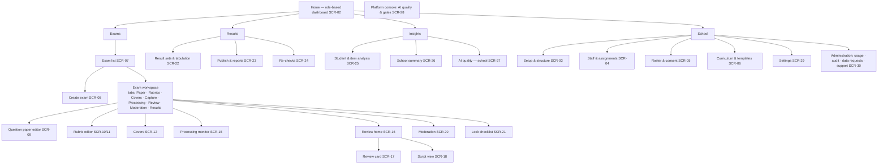
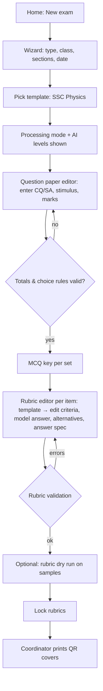
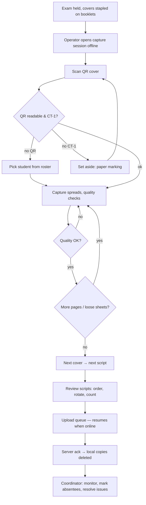
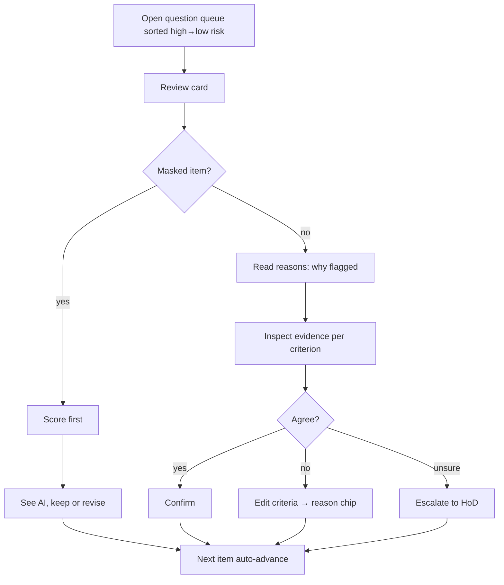
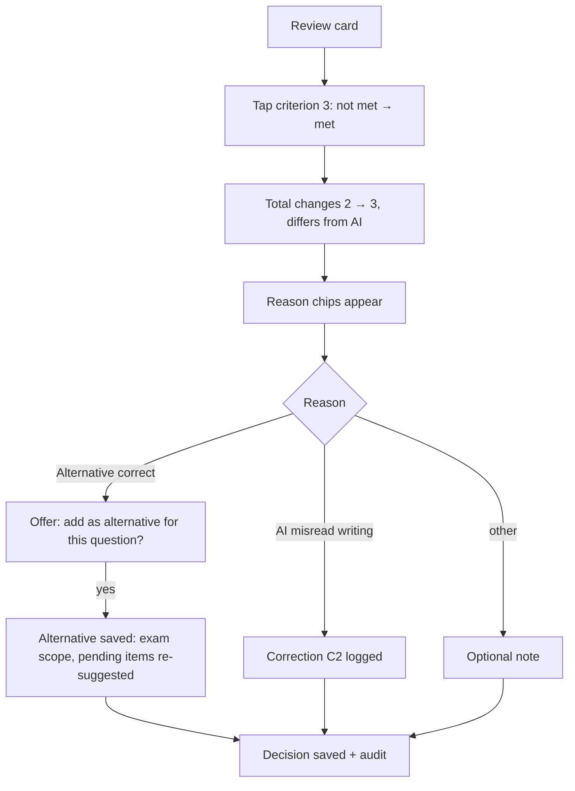
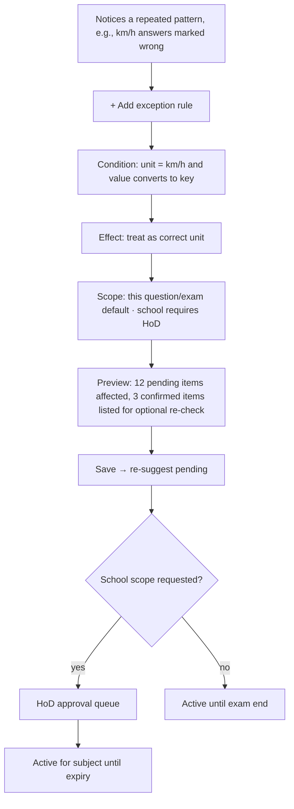
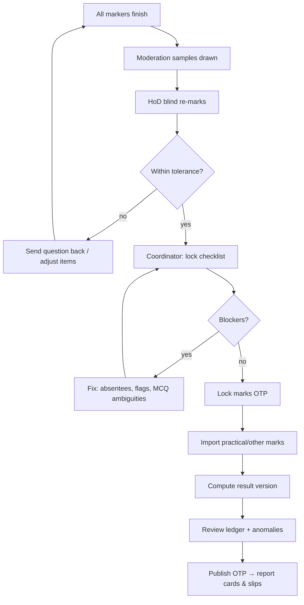
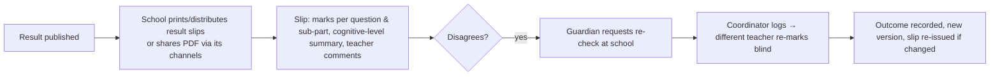
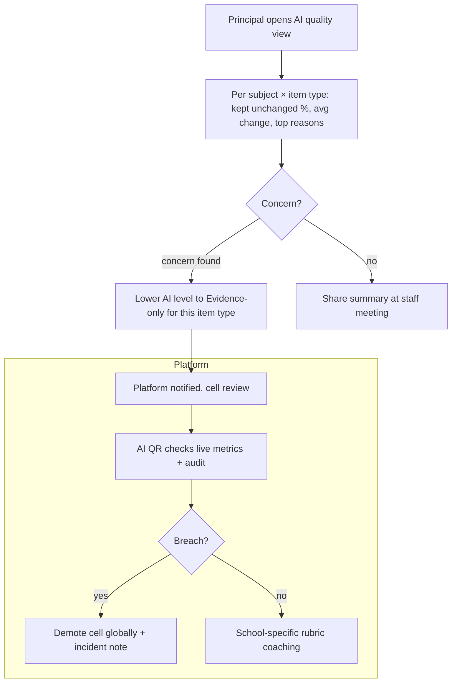

# 04 — Wireframing Document (UX Structure & Interaction Specification)

| Field | Value |
|---|---|
| Document Name | Wireframes, Screen Specifications and User Flows |
| Version | 1.0 |
| Status | Baseline for design and usability testing (EXP-09) |
| Date | 2026-09-27 |
| Owner | UX Lead (with Product) |
| Purpose | Defines the structure, content hierarchy and interaction of every screen and the end-to-end user flows. Visual design is in `05-ui-ux-design.md`. |
| Source Research | S11/S11a (screen inventory, REV-01, keyboard-first review, edge cases), S03 (moments of truth), S09 (review actions, masking), S08 (evidence-first); VF-11 (phones), EV-08..EV-10 |
| Dependencies | `01-PRD.md` (FR IDs, user stories), `07` (HITL actions), `03` (APIs) |

**Conventions**
- Screen IDs: `SCR-nn` (web) and `CAP-nn` (Android capture app). Flows: `UF-nn`.
- "Desktop" = ≥1280 px, "Tablet" = 768–1279 px, "Phone" = 360–767 px.
- All strings exist in Bangla and English. Examples show Bangla where the layout needs to prove Bangla fits.
- Permissions refer to `08` §5.3.

---

## 1. Information Architecture



**Primary navigation (web):**
- Desktop: left rail with Home · Exams · Results · Insights · School. The top bar holds the school switcher (multi-school owners), language toggle (বাংলা/English), notifications and profile.
- Phone: bottom tab bar with Home · Exams · Review · More.

**Navigation principle:** a teacher reaches their next review item in ≤2 taps from Home ("Continue marking: Physics 9 — Q2 গ — 34 left").

---

## 2. Screen Specifications

### SCR-01 Sign in & OTP
| Aspect | Specification |
|---|---|
| Purpose | Authenticate staff (DEC-39) |
| User | All staff |
| Entry | App URL / PWA icon |
| Components | Mobile number (with +880 prefix), password, "Forgot password", language toggle; OTP screen (6 boxes, resend timer 60 s) |
| Hierarchy | Language toggle top-right → form → help link |
| Primary action | Sign in |
| Secondary | Forgot password; switch language |
| Empty / Loading | Button spinner; fields disabled while signing in |
| Error | Wrong credentials (generic message); locked account (time to retry); OTP expired (resend) |
| Success | New device → OTP → Home |
| Permissions | Public |

### SCR-02 Home (role-based dashboard)
| Aspect | Specification |
|---|---|
| Purpose | Show each role its next actions |
| User | All |
| Entry | After sign-in |
| Components | **Teacher:** "Continue marking" cards per exam/question (items left, deadline), rubric tasks (exams without locked rubrics), flags returned by HoD. **Coordinator:** exam pipeline board (Draft → Capturing → Reviewing → Moderation → Locked → Published) with counts and deadline risk. **HoD:** moderation queue, flags. **Principal:** exam status summary, recent results, AI view snapshot. **Admin:** setup checklist (roster, consent, staff). |
| Hierarchy | Next action first; status second; information last |
| Primary action | Role-specific (e.g., "Continue marking") |
| Empty | New school: guided setup checklist (SCR-03) |
| Loading | Skeleton cards |
| Error | Offline banner: "You're offline. Marking decisions will sync." |
| Permissions | Content filtered by role scopes |

```
┌──────────────────────────────────────────────────────────────────────────┐
│ ☰ Khata  │ Dhanmondi Model School ▾ │  বাংলা | EN │ 🔔 3 │ Farhana ▾      │
├──────────┼───────────────────────────────────────────────────────────────┤
│ Home     │  Continue marking                                             │
│ Exams    │  ┌───────────────────────────┐ ┌───────────────────────────┐  │
│ Results  │  │ Physics · Class 9 · H-Y   │ │ Physics · Class 10 · Test │  │
│ Insights │  │ Q2 (গ) application        │ │ Rubric not locked         │  │
│ School   │  │ 34 of 212 left · due Thu  │ │ [Finish rubric]           │  │
│          │  │ [Continue ▶]              │ └───────────────────────────┘  │
│          │  └───────────────────────────┘                                │
│          │  Returned to you (2)   HoD: "Check unit deductions Q3 গ"      │
└──────────┴───────────────────────────────────────────────────────────────┘
```

### SCR-03 School setup (wizard + structure)
| Aspect | Specification |
|---|---|
| Purpose | Configure school, academic year, classes, groups, versions, shifts, sections |
| User | School admin |
| Entry | First login checklist; School → Setup |
| Components | Stepper: 1 School profile (names BN/EN, EIIN optional, board, logo) → 2 Academic year → 3 Classes & sections grid (class × group × version × shift) → 4 Booklet profile (front cover present? per-page roll header? mask height) → 5 Review |
| Primary action | Save & continue |
| Secondary | Import sections from Excel |
| Empty | Template suggestion: "Class 9–10: Science/Humanities/Business × Bangla/English version" |
| Error | Duplicate section names; missing year |
| Success | Checklist ticks; next: Staff |
| Permissions | School admin |

### SCR-04 Staff & teaching assignments
| Aspect | Specification |
|---|---|
| Purpose | Invite staff and assign roles and subject-sections (FR-ORG-04/05) |
| User | School admin |
| Components | Staff table (name, mobile, roles, status); invite dialog (mobile + role); assignment matrix (rows: sections; columns: subjects; cells: teacher picker) |
| Primary action | Invite / Assign |
| Secondary | Import staff from Excel; deactivate user (wipes capture queues) |
| Empty | "Invite your first teacher" |
| Error | Mobile already used in another tenant (allowed; separate role); invalid number |
| Permissions | School admin |

### SCR-05 Roster & consent
| Aspect | Specification |
|---|---|
| Purpose | Import students; record guardian consent CT-1/2/3 (FR-ORG-03/06) |
| User | School admin |
| Components | Import wizard (upload → auto-detect columns → **Bijoy→Unicode preview** with highlighted converted names → validation report → commit); student list per section with consent chips (CT-1 ✓, CT-2 ✓, CT-3 –); bulk consent import; print consent forms (BN/EN) |
| Primary action | Commit import / Save consent |
| Secondary | Download error report; print forms |
| Empty | Sample Excel template link |
| Loading | Progress bar for large files |
| Error | Row-level errors (missing roll, duplicate roll, unknown section) with a fix-in-place table |
| Success | "498 students imported, 2 need attention" |
| Permissions | School admin |

### SCR-06 Curriculum & templates
| Aspect | Specification |
|---|---|
| Purpose | Browse curriculum packs; manage the school's paper templates and rubric template library |
| User | Teacher (view), HoD/Coordinator (manage school templates) |
| Components | Curriculum tree (version → class → group → subject → chapters); paper templates list (platform ⓟ vs school ⓢ); template editor (components, choice rules, pass rules); rubric template library by subject × CQ part |
| Primary action | Use template / Save school template |
| Error | Template totals don't add up (inline) |
| Permissions | View all; edit per role |

### SCR-07 Subject workspace & exam list
| Aspect | Specification |
|---|---|
| Purpose | A teacher's home for a subject: exams, their states, rubric library |
| User | Teacher, HoD |
| Components | Filters (class, exam type, state); exam cards with state chip and progress; "New exam" |
| Primary action | New exam / Open exam |
| Empty | "No exams yet. Create from an SSC-format template." |
| Permissions | Assigned subjects |

### SCR-08 Create exam (wizard)
| Aspect | Specification |
|---|---|
| Purpose | Create an exam from a template (FR-EXM-01) |
| User | Teacher, Coordinator |
| Components | Step 1: type, class, group, sections (multi), date, marking deadline. Step 2: template picker (preview of components, e.g., "CQ 40 (4 of 7) · SA 10 · MCQ 25 · Practical 25"). Step 3: processing mode (Standard overnight / Priority), AI level summary per item type ("Physics গ: AI suggests · Physics ক (Bangla): AI shows evidence only"). Step 4: review. |
| Primary action | Create exam |
| Secondary | Clone previous exam (S) |
| Error | Sections in different groups; date in the past |
| Success | Opens the Question paper editor |
| Permissions | Teacher (own subject), Coordinator |

### SCR-09 Question paper editor
| Aspect | Specification |
|---|---|
| Purpose | Enter questions, sub-parts, marks, stimulus, MCQ keys (FR-EXM-02/04/06) |
| User | Teacher |
| Components | Left: outline tree (CQ 1–7 with ক/খ/গ/ঘ; SA 1–7; MCQ 1–25). Centre: editor for the selected node (rich text BN/EN, math editor, image upload, marks). Right: live totals and choice-rule check ("CQ: 7 questions, answer 4, 40 marks ✓"). MCQ tab: key grid per set (ক/খ/গ/ঘ). (S) "Import paper" button (PDF/DOCX → AI draft → review diffs). |
| Primary action | Save |
| Secondary | Preview as printed; import paper (S) |
| Empty | Outline pre-built from the template |
| Error | Sum mismatch (red chip on the node); missing MCQ key |
| Success | "Paper complete → next: Rubrics" |
| Permissions | Teacher; pre-exam confidentiality (SEC-11) |

### SCR-10 Rubric & model answer editor
| Aspect | Specification |
|---|---|
| Purpose | Define criteria, model answer, alternatives, answer spec, ECF (FR-RUB-01..05, -07) |
| User | Teacher |
| Components | Per item: question text (collapsed); **criteria list** (text BN/EN, marks, type: concept/step/final answer/unit) with "Use template" (e.g., "Physics গ: formula · substitution · answer+unit"); **model answer** (rich text + math); **alternatives** (accepted answers/methods, synonyms, equivalent forms); **answer spec** (numeric value, tolerance, unit, sig-fig policy / expression LaTeX); **deductions & ECF** toggle; AI eligibility indicator ("AI-ready ✓" / "Needs model answer"); validation panel |
| Primary action | Save; "Lock all rubrics" (exam level) |
| Secondary | Rubric dry run (SCR-11, S); copy from the library; AI draft (S) |
| Empty | Template suggestions by item type |
| Error | Criteria total ≠ item marks; vague criterion warning ("'good explanation' has no observable evidence") |
| Success | Lock → confirmation with a summary of AI-eligible items |
| Permissions | Teacher (own), HoD (subject) |

```
┌ Q2 (গ) — 3 marks — Application ─────────────────────── AI-ready ✓ ┐
│ Criteria                                         marks  type       │
│ 1  Writes v = u + at (or equivalent)              1     step       │
│ 2  Substitutes u=2, a=1.5, t=7 with units         1     step       │
│ 3  v = 12.5 m s⁻¹ (unit required)                 1     final+unit │
│ [+ criterion]  [Use template ▾]                  Σ 3/3 ✓           │
│ Model answer:  v = u + at = 2 + 1.5×7 = 12.5 m/s                   │
│ Answer spec:   value 12.5  tol ±0.1  unit m/s  (km/h accepted ✓)   │
│ Alternatives:  "v − u = at"   "বেগ = আদিবেগ + ত্বরণ × সময়"        │
│ ECF: ☑ penalise first error once; credit correct later steps       │
└─────────────────────────────────────────────────────────────────────┘
```

### SCR-11 Rubric dry run (Should)
Purpose: test the AI on 3–5 sample answers before lock (FR-RUB-09). Components: pick samples (upload photos or choose captured scripts), results table with suggestions per criterion, "Edit rubric" links. Empty: "Add 3–5 sample answers". Error: an item not AI-eligible. Permissions: teacher.

### SCR-12 Cover sheets
| Aspect | Specification |
|---|---|
| Purpose | Print QR cover sheets with MCQ bubble grid (FR-EXM-05) |
| User | Coordinator |
| Components | Section selector; preview of one cover (identity zone, QR, bubble grid with set code, instruction line); options: include blank spare covers (count), printer margins test page; "Generate PDF" |
| Primary action | Generate & download PDF |
| Secondary | Print test page; regenerate for late-enrolled students |
| Empty | "Rubrics must be locked first" (blocked state with link) |
| Loading | Job progress |
| Error | Students missing CT-1 are listed as "paper marking" (no cover generated, per FR-ORG-06) |
| Success | "142 covers + 10 spares ready" |
| Permissions | Coordinator |

```
┌──────────────── COVER (A4) ────────────────┐
│ Dhanmondi Model School · Half-yearly 2027   │
│ Class 9 · Science · EV · Section B          │
│ Physics · Roll 17 · [Name printed here]     │  ← identity zone (never sent to AI)
│ ┌──────┐   Write question numbers clearly:  │
│ │ QR   │   e.g. 2(c) / ২(গ). No name inside.│
│ └──────┘                                    │
│ MCQ  Set: (ক)(খ)(গ)(ঘ)                      │
│ 1 (ক)(খ)(গ)(ঘ)   14 (ক)(খ)(গ)(ঘ)            │
│ …                                           │
│ ■ fiducials in corners                      │
└─────────────────────────────────────────────┘
```

### CAP-01…CAP-05 Android capture app
| Screen | Purpose | Components | States |
|---|---|---|---|
| CAP-01 Sessions | Choose the exam/section to capture; download for offline use | List of assigned sessions (exam, section, expected scripts); download status; storage indicator | Empty: "No capture sessions assigned"; Offline: cached sessions only |
| CAP-02 Camera | Capture covers and spreads | Live preview with document edge overlay; mode chip ("Cover" / "Pages"); auto-capture toggle; counter "Script 17 · page 6"; quality toast (blur/glare/cut-off) with a haptic buzz; "Loose sheet?" prompt at the end of each script; big shutter; "Next student" | Quality fail: red border + "Retake — blurry"; QR not found: "Tap to pick student"; No CT-1: "Mark on paper" (blocks linking) |
| CAP-03 Script review | Check pages before upload | Thumbnail strip; reorder by drag; rotate; delete; insert; page count vs expected ("10 pages · expected 8–16 ✓"); blank auto-tagged | Warning: duplicate spread; too few pages |
| CAP-04 Upload queue | Monitor upload | Scripts with states (queued/uploading/acknowledged/failed); Wi-Fi-only toggle; retry | Offline: "Will upload when online"; Error: server rejected (reason) |
| CAP-05 Late sheet | Append a supplementary sheet to an uploaded script | Scan cover → shows the script → capture sheets → append | Script already locked: blocked with message |

```
CAP-02 (phone, landscape spread)
┌──────────────────────────────────────────────┐
│  Script 17 · Roll 17 · pages 6/≈10   Auto ◉  │
│ ┌──────────────────┬───────────────────────┐ │
│ │  left page       │     right page        │ │  ← green outline = OK
│ │                  │                       │ │
│ └──────────────────┴───────────────────────┘ │
│  ⚠ Glare on right page — tilt slightly        │
│   [Loose sheet +]      (◯ shutter)   [Next ▶] │
└──────────────────────────────────────────────┘
```

### SCR-14 PDF import
Purpose: import scanner PDFs split by QR covers (FR-CAP-08). Components: upload (chunked), progress, split preview listing scripts detected, unmatched pages list for manual assignment. Error: no covers detected, low resolution (<200 dpi) warning. Permissions: Coordinator.

### SCR-15 Processing monitor (exam)
| Aspect | Specification |
|---|---|
| Purpose | Show capture and processing progress; resolve issues (FR-CAP-09, FR-PRC-01) |
| User | Coordinator (teachers read-only for their sections) |
| Components | Funnel: Expected → Captured → Uploaded → Processed → Ready for review (per section). "Needs attention" list: missing students, unreadable QR, failed pages (retake), unmapped items count, absent marking. Processing mode + ETA ("Standard: ready by 07:00"). Button "Mark absent" |
| Primary action | Resolve issue (context button per row) |
| Secondary | Switch to Priority for this exam (cost shown) |
| Empty | "No scripts captured yet" with a capture app QR |
| Error | Vendor incident banner: "AI suggestions delayed; you can start manual marking" |
| Permissions | Coordinator; teachers read-only |

```
┌ Physics · Class 9 · Half-yearly ──────── Standard mode · ready by 07:00 ┐
│ Section A  ██████████ 48/48 captured · 48 processed · 0 issues          │
│ Section B  ████████░░ 41/46 captured · 5 missing ▸ [view]               │
│ Needs attention (7)                                                     │
│  • Roll 23 (B): page 4 blurry — [ask to retake]                        │
│  • Script #9f3: QR unreadable — [link student]                         │
│  • 3 answers not matched to a question — [open mapping queue]          │
└─────────────────────────────────────────────────────────────────────────┘
```

### SCR-16 Review home (question queues)
| Aspect | Specification |
|---|---|
| Purpose | Choose which question to mark (question-wise default, DEC-06) |
| User | Teacher |
| Components | Table of questions × sub-parts with: items left, AI level badge (L0 Manual / L1 Evidence / L2 Suggests / L3 Batch), risk mix (● high ● medium ● low counts), flags; filters (section); "Script view" toggle; "Unmapped answers (3)" queue |
| Primary action | Start / continue a question |
| Secondary | Mark by script; open unmapped queue |
| Empty | "Suggestions will be ready by 07:00. You can start manual marking now." |
| Permissions | Assigned sections |

### SCR-17 Review card (the core screen)

**Structure (desktop, 60/40 split):** the human-review sequence required by the prompt, from left to right and top to bottom:

1. **Student answer.** Crop(s) of all mapped regions, zoomable, with region outlines. The context strip shows neighbouring content above and below.
2. **AI interpretation.** Transcript (if available; otherwise a "Show text" button) directly under the crop, with uncertain spans dotted-underlined.
3. **Rubric.** The criteria list with marks.
4. **AI suggested score.** Per criterion (met / partly / not met / cannot determine), then the total. The total is shown **after** the criteria (criteria-first, DEC-33).
5. **Evidence.** Hovering or tapping a criterion highlights its evidence region(s) on the crop and the quoted text.
6. **Confidence / risk.** Level chip (Low/Medium/High) with plain-language reasons ("Two AI readers disagreed", "Near pass mark", "Handwriting unclear").
7. **Reason.** A one-line reason per criterion (≤25 words).
8. **Teacher decision.** Criterion toggles and marks; the total updates live. Actions bar.

| Aspect | Specification |
|---|---|
| Purpose | Decide one item quickly and confidently (FR-REV-02..05, 07 §4.2) |
| User | Teacher (also HoD; moderation/re-check modes) |
| Entry | Review home → question; notifications; script view |
| Components | Header: exam · question · sub-part · marks · progress "34 left" · level badge · risk chip. Left pane: answer crop(s), zoom, rotate, "view whole page", context strip. Right pane: criteria with AI decisions + evidence links; model answer (collapsed); scoped clarifications applied (chips); verification badges (value matches key ✓, unit missing ⚠, CAS equivalent ✓ / cannot verify ?). Bottom action bar. |
| Primary action | **Confirm** (Enter/Space) |
| Secondary actions | **Edit** (click criterion or digit keys) → reason chips; **Mark manually** (hide AI); **Re-evaluate** (with optional note); **Add clarification**; **Add alternative answer**; **Add exception rule** (S); **Report AI error**; **Escalate to HoD**; **Remap** to another question; **Blank / not attempted**; **Undo** |
| Masked item | Right pane shows criteria **without** AI decisions and a banner "Score this one first — AI view hidden (quality check)". After the teacher decides, the AI decision appears with "Keep mine / Use AI". |
| Empty | "All done for this question 🎉 — next question ▸" |
| Loading | Crop skeleton; prefetched next items make this rare |
| Error | Image failed → retry, or open the full page; sync failure → queued badge |
| Success | Toast "Saved" (non-blocking); auto-advance |
| Permissions | Assigned sections; modes restrict visibility (moderation/re-check hide AI and the original marks) |

```
DESKTOP ─ SCR-17
┌ Physics 9 · Half-yearly · Q2 (গ) application · 3 marks · 34 left ─ [L2 AI suggests] [● Medium risk] ┐
│┌──────────────── Student answer (crop) ───────────────┐┌──────── Rubric & AI ─────────────────────┐│
││  [ zoom − + ]  [whole page]  [rotate]                ││ Why flagged: two AI readers disagreed on ││
││                                                      ││ criterion 3 · near grade boundary       ││
││   v = u + at                  ⟵ evidence (c1)        ││                                          ││
││   = 2 + 1.5 × 7               ⟵ evidence (c2)        ││ ☑ 1 Writes v = u + at         1/1  met  ││
││   = 12.5                      ⟵ evidence (c3)        ││   “v = u + at” (line 1)                  ││
││                                                      ││ ☑ 2 Substitutes with units    1/1  met  ││
││──────────────────────────────────────────────────────││ ☐ 3 12.5 m/s with unit        0/1  not  ││
││ Text (AI reading):  v = u + at = 2 + 1.5×7 = 12.5    ││   Value matches key ✓  Unit missing ⚠   ││
││                     ········ (uncertain)             ││                                          ││
│└──────────────────────────────────────────────────────┘│ AI suggests: 2 / 3                        ││
│                                                        │ Applied: clarification “unit required”   ││
│                                                        │ ▸ Model answer                            ││
│                                                        └──────────────────────────────────────────┘│
│ [✔ Confirm 2]  [✎ Edit]  [Manual]  [↻ Re-evaluate]  [+ Clarify] [+ Alternative] [⚑ HoD] [⚠ AI error] │
│  Keys: Enter confirm · 0-9 set mark · E edit · M manual · F flag · ←/→ prev/next · U undo           │
└─────────────────────────────────────────────────────────────────────────────────────────────────────┘
```

```
PHONE ─ SCR-17m (question-wise, one item per screen)
┌──────────────────────────────┐
│ Q2 (গ) · 3 marks · 34 left   │
│ [L2 AI suggests] ● Medium ▾  │  ← tap: reasons
│┌────────────────────────────┐│
││  answer crop (pinch zoom)  ││
││  highlighted evidence      ││
│└────────────────────────────┘│
│ ✓ Formula          1/1       │
│ ✓ Substitution     1/1       │
│ ✗ Answer + unit    0/1 ⚠unit │
│ AI suggests 2/3              │
│ ┌──────────────────────────┐ │
│ │     ✔ Confirm 2          │ │  ← thumb zone
│ └──────────────────────────┘ │
│ [Edit] [Manual] [More ⋯]     │
│  swipe ← next · → previous   │
└──────────────────────────────┘
```

**Edit interaction:** tapping a criterion cycles met → partly (if allowed) → not met, or opens a marks stepper. When the total differs from the AI suggestion, **reason chips** appear (one tap; FR-REV-04): *AI misread writing · Alternative correct · Rubric unclear · AI too lenient · AI too strict · Partial credit · Calculation checked · Other…*. Choosing "Alternative correct" offers "Add as accepted alternative for this question?" (C4 route).

### SCR-18 Script view
| Aspect | Specification |
|---|---|
| Purpose | See a whole script: completeness, totals, choice-rule application (FR-REV-07) |
| User | Teacher, HoD, Coordinator (re-check) |
| Components | Page thumbnails with region overlays coloured by status (decided ✓, pending ○, flagged ⚑, unmapped ?); item list with marks; component totals; choice-rule indicator ("5 of 8 CQ attempted; counted: first 5"); MCQ bubble results with flagged ambiguities to resolve; completeness checklist (all items decided, all non-blank pages viewed) |
| Primary action | Mark script complete |
| Secondary | Jump to item; remap region; resolve MCQ flags |
| Error | Unviewed non-blank page blocks completion |
| Permissions | Assigned sections |

### SCR-19 Knowledge dialogs (clarification / alternative / exception / AI error / escalation)
- **Add clarification:** text (BN/EN), scope fixed to "this question in this exam" (school scope requires HoD → "Propose for school library"). Preview: "Will update 34 pending suggestions."
- **Add alternative:** answer text or expression; equivalence type (text meaning / exact value / expression); optional example region (the current answer). Preview count.
- **Exception rule (S):** condition ("unit km/h") → effect ("treat as equivalent") → scope → expiry (default end of exam).
- **Report AI error:** category (misread, wrong criterion judgement, wrong mapping, other) + note.
- **Escalate to HoD:** comment. The item becomes Flagged and blocks script completion.

### SCR-20 Moderation (HoD)
| Aspect | Specification |
|---|---|
| Purpose | Blind re-mark samples; compare; decide outcomes (FR-MOD-01) |
| User | HoD |
| Components | Marker list with sample status; moderation card (same as SCR-17 with the AI and the original mark hidden); comparison report (item-level differences, exact/±1 agreement); outcome buttons: Accept · Send question back to marker · Adjust items |
| Empty | "Sample appears when a marker finishes" |
| Permissions | HoD |

### SCR-21 Lock checklist
Purpose: completeness and lock (FR-MOD-02/03). Components: checklist (captured/absent accounted, all items decided, flags resolved, moderation complete, MCQ ambiguities resolved), each with a link to fix. "Lock marks" button (Coordinator, OTP). Error: blockers listed. Success: state MarksLocked, audit entry. Unlock requires a reason + OTP.

### SCR-22 Result sets & tabulation
| Aspect | Specification |
|---|---|
| Purpose | Combine exams and imported marks; compute results; produce tabulation (FR-RES) |
| User | Coordinator |
| Components | Result set builder (exams + weights, e.g., CT 30% + H-Y 70%); import practical/other subjects (Excel with validation); policy panel (pass rules, rounding, choice-rule policy, grading table); computed ledger preview (sortable, Bangla/English); anomalies (absent vs zero, missing marks) |
| Primary action | Compute / Save version |
| Secondary | Export Excel/CSV (ERP presets); PDF tabulation sheet; merit list |
| Error | Import row errors; missing marks block the final version |
| Permissions | Coordinator; principal read |

### SCR-23 Publish & reports
Purpose: publish a result version; generate report cards and result slips (FR-RES-09, FR-FBK-01). Components: version summary (pass %, GPA-5 count); "Approved comments only" indicator; report card template preview (BN/EN); SMS option (S); **Publish (OTP)**. Success: downloadable PDFs; version locked. Error: unapproved comments are excluded (listed).

### SCR-24 Re-checks
Purpose: log and manage re-check requests (FR-APL). Components: request form (student, items or whole script, reason, requested via, date); assignment (a different teacher by default; blocked for the original marker); status board; decision view for the re-marker (AI hidden, original hidden until decided); outcome → republish prompt. Permissions: Coordinator (log), HoD (assign/approve), Teacher (re-mark).

### SCR-25 Student performance & item analysis
Purpose: teaching insight after lock (FR-FBK-03, FR-ANL-03). Components: item difficulty (mean %), cognitive-level breakdown per section, most common deduction reasons, common alternatives, student list with per-component marks. Empty: "Available after marks are locked". Permissions: teachers (own sections), HoD (subject), principal (aggregates only).

### SCR-26 School summary (principal/owner)
Pass rates, grade distributions, GPA-5 counts by class/section/exam, trends; exam timeline adherence (days from exam to publication). No per-teacher ranking by default (OQ-18).

### SCR-27 AI quality — school view
| Aspect | Specification |
|---|---|
| Purpose | Let the school see whether AI helps and where it errs (FR-AIQ-01) |
| User | Principal, HoD, Coordinator |
| Components | Per subject × item type: AI level, suggested items, % confirmed unchanged, average change (marks), top correction reasons, masked-item agreement (aggregate), trend by exam; plain-language explainer ("AI suggested marks for 2,140 answers; teachers kept 81% unchanged; most changes: unit deductions") |
| Empty | "No AI suggestions yet" |
| Permissions | Principal, HoD, Coordinator |

### SCR-28 Platform AI quality & gates (internal console)
| Aspect | Specification |
|---|---|
| Purpose | Monitor cells; run evaluations; promote or demote levels (FR-AIQ-02/03) |
| User | Platform AI Quality Reviewer |
| Components | Cell matrix (subject × item type × script) with level, live metrics (change rate, masked gap, live-audit severe rate, validity, PSI, cost/page), alerts; evaluation runs list; gate report view (metrics + CIs vs thresholds, subgroup table, red-team result); promote/demote with 2-person sign-off; kill switches |
| Primary action | Approve level change / demote |
| Error | Missing gate report blocks promotion |
| Permissions | Platform roles only |

### SCR-29 Settings
Processing mode default; AI level caps per subject; moderation %; re-check window; retention window (90–365 days); rounding/half-marks; choice-rule policy; grading table; SMS; language default. Every change shows its effect and is audited.

### SCR-30 Administration
Usage & allowance (bar with 80% alert, projected overage); invoices & payments (manual recording); audit log viewer (filters, export); data requests (export/delete student data, certificates); support access requests (approve/deny, duration); devices (capture devices, wipe).

---

## 3. User Flows

### UF-01 Teacher creates an exam


### UF-02 Answer scripts are captured and uploaded


### UF-03 AI evaluates (system flow; teacher-visible outcomes)

```mermaid
flowchart LR
  A[Scripts submitted] --> B[Standard: queued until 22:00 batch]
  B --> C[Normalise, classify, OMR]
  C --> D[Identity pages isolated]
  D --> E[AI reads + checks criteria for L1+ cells]
  E --> F[Verification: grounding, maths, units, injection]
  F --> G[Risk level + reasons]
  G --> H[Queues ready by 07:00]
  H --> I[Teacher notified: 'Physics Q2 ready']
```


### UF-04 Teacher reviews uncertain answers


### UF-05 Teacher modifies a score


### UF-06 Teacher creates a correction rule (clarification or exception)


### UF-07 Final results are approved and published

Teachers "approve" their marks by completing their items and scripts. Moderation and lock are the institutional approval (RACI in `07` §3.2).

### UF-08 Student receives feedback


### UF-09 Administrator reviews AI performance


---

## 4. Edge-case interaction specifications

| Case | Where | Interaction |
|---|---|---|
| Missing page / loose sheet found later | CAP-05, SCR-15 | Re-scan the cover → append → the affected items re-process; teacher sees "new page added" badge |
| Duplicate page | CAP-03 | Warning with side-by-side; delete one |
| Wrong page order | CAP-03 / SCR-18 | Drag reorder; the mapper uses labels, so order errors mostly affect continuation; the teacher can remap |
| Poor image quality | CAP-02 | Blocking retake prompt (override with reason) |
| Blank pages | CAP-03 / SCR-18 | Auto-tagged blank; the teacher can untag |
| Crossed-out answers | SCR-17 | Crossed-out regions shown hatched and excluded; if the only attempt, flagged "crossed out — decide" |
| Multiple answers to the same part | SCR-17 | "Two attempts found" banner; no AI suggestion; the teacher picks which counts |
| Answer under the wrong number | SCR-17 | "Content looks like Q3(গ)" hint when detectable; Remap button |
| Unmapped region | SCR-16 | "Unmapped answers" queue: assign to an item or mark as rough work |
| Diagrams | SCR-17 | Diagram region shown with "Diagram — mark manually" label (L1) |
| Instruction text found | SCR-17 | Red banner "Contains text addressed to the examiner — ignored by AI"; no auto-confirm possible |
| Student without CT-2 | SCR-17 | "Manual (no AI consent)" badge; no suggestion |
| Offline during review | SCR-17 | Banner; continue on prefetched items; decisions queue |
| Rubric changed after lock | SCR-17 | "Rubric v2: suggestion updated" badge on pending items; confirmed items listed for optional re-check |
| Over-answered choice questions | SCR-18 | Indicator of counted vs not counted; policy per school |
