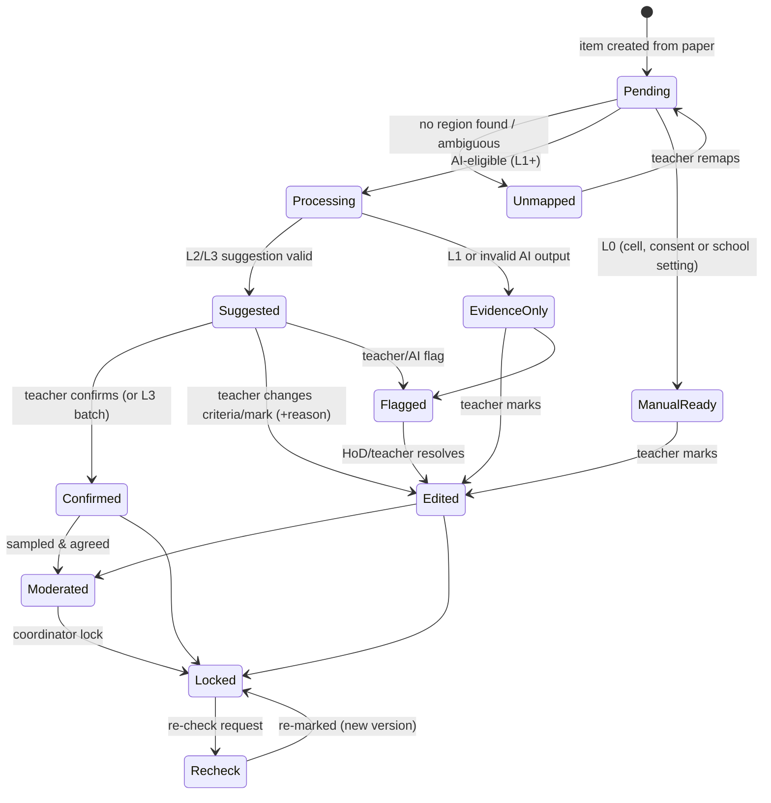
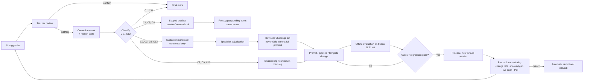

# 07 — Human-in-the-Loop and Continuous Improvement Specification

| Field | Value |
|---|---|
| Document Name | HITL & Continuous Improvement Specification |
| Version | 1.0 |
| Status | Baseline |
| Date | 2026-09-27 |
| Owner | Assessment Lead (with Product and AI leads) |
| Purpose | Defines who decides what, how teachers review, correct, teach and configure the system, how disputes and escalations work, and how human corrections improve the product without contaminating it. |
| Source Research | S09 (HITL governance), S08 (automation bias, appeals), S10 (override hygiene, opt-in), S03 (human control matrix), S11/S11a (review UX, spot checks); VF-08, VF-12, VF-13; EV-08, EV-22, EV-32 |
| Dependencies | `01-PRD.md` FR-REV, FR-HITL, FR-MOD, FR-APL, HITL-01..07; `06` (levels, gates, monitoring); `03-system-design.md` §9 (HITL architecture) |

---

## 1. Operating point

> **AI handles scale and repetitive cognitive work. Teachers handle judgement, ambiguity, exceptions and governance. The system captures *validated* human knowledge in *scoped, versioned* artefacts, and changes its global behaviour only through evaluated releases.**

| Stakes context | Mode | Applies in product |
|---|---|---|
| Public board exams (SSC/HSC) | Out of scope (would be Human-in-Command) | No |
| Internal term exams (half-yearly, annual, test, pre-test) | **HITL: teacher confirms every mark**; L3 batch confirmation only for gated cells; HoD moderation before lock | Yes (MVP) |
| Class tests, model tests | Same as term exams in v1. Phase 5 may allow low-stakes autonomy after DEC-05 conditions are met. | Yes |

---

## 2. Division of labour

| Question | Answer |
|---|---|
| **What AI does** | Reads pages; finds answer regions and question labels; transcribes; checks criteria against evidence; extracts final answers; reads MCQ letters; flags blank, crossed-out and instruction-like content; drafts rubric structures and feedback on request; estimates risk. |
| **What deterministic software does** | Identity (QR), page order, image quality, MCQ bubbles, arithmetic, rubric rules (caps, ECF), choice rules, CAS/unit checks, pass rules, GPA, tabulation, audit, routing rules. |
| **What AI suggests** | Criterion decisions and marks (L2+), with evidence; item risk level and reasons; draft comments; draft paper structure and rubrics. |
| **What teachers do** | Write the paper, rubric and model answers. Confirm or correct every mark. Add alternatives and clarifications. Remap answers. Flag problems. Approve feedback. Decide re-checks. |
| **What humans approve** | Every final mark (teacher). Rubric lock (teacher; HoD optional). School-scope rules and instructions (HoD). Moderation outcome (HoD). Marks lock and publication (coordinator, OTP). Capability-level promotions (two platform reviewers). |
| **What humans can override** | Any AI decision, any suggested mark, any mapping, any automatic "blank" classification, AI level (lower only, per exam or item), MCQ key after the exam (audited). |
| **What humans can teach** | Alternative answers and methods; clarifications of criteria; exception rules; marking instructions; rubric templates (school library); corrections labelled with reasons. |
| **What humans can configure** | Moderation sample rate, processing mode, re-check window, retention window, rounding and half-mark policy, choice-rule policy, grace-mark policy (Phase 3), grading scale, AI level caps. |
| **What the system can learn (and how)** | Within an exam: alternatives and clarifications re-suggest pending items (minutes). Within a school: approved instructions and rubric templates (next exam). Globally: prompt, template and model improvements, only through offline evaluation and gates (quarterly releases). |
| **What the system must NOT learn automatically** | See §7. |

---

## 3. Roles and decision rights

### 3.1 Roles
| Role | Scope | Key rights | Cannot |
|---|---|---|---|
| Teacher (marker) | Assigned subject × sections, per exam | Create exams and rubrics for own subject; review, confirm and edit marks; add alternatives and clarifications (question/exam scope); flag; request re-suggestion; approve comments | See other sections' scripts; change locked marks; raise AI levels; publish |
| HoD / Moderator | Subject across the school | Everything a teacher can, for the subject; moderation; adjudicate flags; approve school-scope rules and instructions; lock rubrics for the department | Publish results; change platform levels |
| Exam Coordinator | School exams | Create exams, print covers, manage capture, import other marks, run completeness checks, lock marks, publish (OTP), log re-checks and assign re-markers | Edit item marks (except via re-check assignment to self when permitted) |
| Principal | School | Read dashboards and AI view; approve exceptional unlocks (policy); sign off re-check by original marker when no alternative exists | Mark items (unless also a teacher) |
| School Admin | School | Roster, roles, consent, settings, usage, audit viewer, data requests | Mark items |
| Capture Operator | Assigned exams | Capture, upload, fix page order, link covers | See marks or AI output |
| Platform AI Quality Reviewer | Platform | Run evaluations; propose and approve level changes (2-person); demote | Access identifiable student data outside consented evaluation sets |
| Platform Assessment Specialist | Platform | Maintain curriculum packs and rubric templates; adjudicate gold data | Access live school data without support grant |
| Platform Support | Per granted tenant, time-boxed | Diagnose issues with school-approved access | Change marks |

### 3.2 RACI for key decisions
R = responsible, A = accountable, C = consulted, I = informed.

| Decision | Teacher | HoD | Coordinator | Principal | Platform |
|---|---|---|---|---|---|
| Item final mark | R/A | C (on flag) | I | — | — |
| Rubric content & lock | R/A | C | I | — | — |
| School-scope instruction / rule | R (propose) | A | I | I | — |
| Moderation outcome | C | R/A | I | I | — |
| Marks lock & publish | I | C | R/A | C | — |
| Re-check outcome | R (re-marker) | A | R (logging) | I | — |
| Cell support level | — | — | — | I | R/A (2 reviewers) |
| AI incident notification | I | I | I | I | R/A |

---

## 4. Review workflow

### 4.1 Item states

"Confirmed" and "Edited" both mean the mark is teacher-decided. Only teacher-decided items can be locked.

### 4.2 Teacher actions (catalogue)

| Action | Effect | Required inputs | Knowledge captured |
|---|---|---|---|
| **Approve** | Mark = suggestion; item Confirmed | — | Agreement event |
| **Edit** | Criterion or total changed; item Edited | Reason (one tap) if the change is ≥1 mark or any criterion differs | Correction event (§5) |
| **Reject suggestion / mark manually** | Suggestion hidden; teacher marks from scratch | Reason optional ("prefer manual") | Rejection event |
| **Request re-evaluation** | AI re-runs on this item (priority lane) with optional note ("look at the second page") | Optional note | Re-run event; note is item-scoped |
| **Add instruction (clarification)** | Clarification attached to the question for this exam; pending items re-suggested | Text | Scoped clarification (§6) |
| **Add alternative answer** | Alternative added to the question for this exam; pending items re-suggested | Text/expression; optional example region | Scoped alternative |
| **Add exception rule** (Phase 3) | Deterministic rule with scope and expiry | Rule form | Rule store |
| **Flag AI error** | Error report with category | Category + optional note | AI error log |
| **Escalate to HoD** | Item Flagged; blocks script completion | Comment | Escalation record |
| **Remap** | Region moved to another item | Target item | Mapping correction |
| **Mark blank / not attempted** | Mark = 0 with status "not attempted" | — | Blank correction if AI said otherwise |

### 4.3 Masked items and automation-bias safeguards (DEC-33)
- 5% of AI-suggested items per teacher (minimum 1 in 20, randomised) are **masked**: the teacher marks first, then sees the AI suggestion and may revise, and both decisions are stored.
- **Criteria-first display**: criterion evidence is shown before the suggested total. The total appears after the criteria panel is rendered in view (UI/UX §8).
- **No batch confirm below L3.** At L3, batches are ≤20 and 1 in 10 thumbnails is forced open.
- **Dwell-time monitor**: a median active time <3 s per item on L2 items over ≥50 consecutive items triggers a gentle in-app prompt and a note in the HoD's moderation sampling (increased sample for that marker). It is never used punitively; OQ-18 policy applies.
- Moderation is blind (no teacher mark, no AI suggestion).

### 4.4 Moderation (DEC-27)
1. When a marker's items are all decided, the system draws a random sample, stratified by risk (default 5% of scripts, minimum 3).
2. The HoD re-marks the sample blind.
3. Report: per item, the marker's mark, the moderator's mark, the difference, the AI suggestion (revealed after the moderator decides), and agreement statistics (exact, ±1).
4. Outcomes:
   - (a) accept;
   - (b) targeted re-review: send the specific question back to the marker for all scripts, with the moderator's note;
   - (c) adjust individual items (moderator decision recorded; the marker is notified).
5. The completed moderation is a lock prerequisite (FR-MOD-02).

---

## 5. Correction taxonomy and routing (DEC-17)

Each edit or flag produces a **correction event**: who, when, item, before/after criterion decisions, reason code, free-text note, scope, and consent flags. The **reason code determines where the knowledge goes.** "Nowhere" is a valid and frequent destination.

| Code | Correction type | Typical reason chosen by teacher | Destination(s) | Scope | Validation before use beyond the item | Can it ever feed model training? |
|---|---|---|---|---|---|---|
| C1 | Mark adjustment, no systemic cause | "Partial credit judgement" | **Item mark only**; analytics (change rate) | Item | — | No |
| C2 | Misread handwriting / transcription error | "AI misread the writing" | Transcription error log → **evaluation candidate** (consented schools) → per-cell CTER monitoring | Item | Assessment specialist confirms the correct reading before it enters DS | Phase 5 only, under DEC-13 |
| C3 | Mapping error | "Answer belongs to another question" (remap) | Mapping error log → pipeline defect stats; eval candidate | Item | Automatic | No (pipeline fix) |
| C4 | Alternative valid answer/method | "Alternative correct answer" + adds alternative | **Question-scoped alternative (this exam)** → re-suggest pending items; optional promotion to the school rubric library | Question/exam → school (with HoD approval) | HoD approval for school scope; platform review for template inclusion | No (knowledge, not weights) |
| C5 | Rubric unclear / clarification | "Rubric unclear" + adds clarification | Clarification (exam scope); **rubric version** if post-lock edit; rubric-template feedback to the platform when frequent | Exam → school | HoD for school scope | No |
| C6 | AI reasoning error (too lenient/strict, wrong criterion judgement) | "AI too lenient" / "AI too strict" | AI error log → **evaluation candidate** → prompt/pipeline improvement backlog; per-cell monitoring | Item | Assessment specialist adjudication before entering DS/GS | Phase 5 only, under DEC-13 |
| C7 | ECF / partial-credit rule misapplied | "Error carried forward wrongly" | Rubric rule check → **engine bug ticket** if the rules were correct; rubric fix if not | Exam | Engineering triage | No |
| C8 | Policy exception | Adds exception rule | **Rule store** (scope + expiry) | Question/exam/school | HoD for school scope | No |
| C9 | Curriculum mismatch | "Doesn't match syllabus/curriculum" | Platform **curriculum pack ticket** | Platform | Assessment specialist | No |
| C10 | Product bug / UX issue | "Other" + note, or the report button | **Bug tracker** | Platform | Triage | No |
| C11 | Student-specific circumstance | "Special consideration" | **Item mark only**; confidential note | Item | — | **Never** |
| C12 | Injection / malicious content confirmed | "Student wrote instructions / inappropriate content" | Security log; red-team set candidate (de-identified, consented) | Platform | Security review | No |

### 5.1 Scoped knowledge artefacts (what can change behaviour, and where)

| Artefact | Created by | Scope levels | Versioned | Takes effect | Reviewed by |
|---|---|---|---|---|---|
| Rubric (criteria, model answer, answer spec) | Teacher | Question (exam) | Yes, lock-based (FR-RUB-08) | Next suggestion run | Teacher; HoD optional |
| Clarification | Teacher during review | Question (exam) | Yes | Pending items of the question (minutes) | Teacher |
| Alternative answer | Teacher during review | Question (exam) → school library | Yes | Pending items (minutes); future exams if promoted | HoD for promotion |
| Exception rule | Teacher/HoD | Question / exam / school subject; expiry | Yes | Immediately for pending items | HoD for school scope |
| Marking instruction | HoD | School subject | Yes | Next exam | HoD |
| Rubric template | Platform / school | Platform / school | Yes | New exams | Assessment specialist / HoD |
| Prompt, pipeline, model route | Platform | Global per cell | Yes (release) | After gate | AI QR ×2 |
| Curriculum pack | Platform | Global per academic year | Yes | New exams | Assessment specialist |

---

## 6. Teacher instructions and precedence
Instruction precedence, highest first (adapted from S09):

1. **Item rubric and answer spec** (the teacher's own, for this question)
2. Question-scoped clarifications and alternatives (this exam)
3. Exception rules (question > exam > school subject)
4. School subject marking instructions (HoD-approved)
5. School policy settings (e.g., half-marks allowed, spelling not penalised)
6. Platform rubric template defaults for the curriculum pack

Conflicts are resolved by precedence, and the applied source is recorded in the suggestion provenance. The review card shows "Applied: clarification by T. Rahman, 12 Jun 14:05" when a clarification affected the suggestion.

---

## 7. What the system must NOT learn automatically

| Never automatic | Why |
|---|---|
| Any change to global prompts, templates, models or thresholds from live corrections | Poisoning and drift; must pass offline evaluation (DEC-17) |
| One teacher's corrections applied to other teachers' exams or other schools | Idiosyncratic leniency or strictness; tenant isolation |
| Corrections from students without data-contribution consent into any dataset | PDPA; DEC-13 |
| Corrections later overturned by moderation or re-check | Wrong labels |
| Special-consideration adjustments (C11) | Not about answer quality |
| Content containing personal data (names, rolls) into exemplars or datasets | Minimisation |
| Injection or malicious examples into exemplar stores | Security |
| Model weights from any customer data (MVP–Pilot) | DEC-13 |

---

## 8. Continuous improvement loop

### 8.1 Cadences
| Loop | Latency | Scope |
|---|---|---|
| Clarification/alternative → re-suggestion | Minutes (priority lane) | Same question, same exam |
| School library promotion (templates, instructions) | Next exam | Same school |
| Rule sandbox (Phase 3): test a proposed school-scope rule against the school's last 1,000 confirmed items of that question type, reporting how many marks would change | Hours | Same school |
| Platform prompt/template/pipeline release | Monthly outside exam seasons; **frozen during declared exam windows** except safety fixes | Global per cell |
| Model change | ≤ twice a year, or on vendor deprecation | Global per cell |
| Gold set refresh (GS-v2…) | Yearly, before the annual exams | Global |

### 8.2 Validation of human corrections before they leave their scope
- **Agreement check:** a school-scope promotion of an alternative requires that it was applied by ≥2 teachers or approved by the HoD.
- **Consistency check:** masked-item agreement and moderation agreement are used to weight a marker's corrections as evaluation candidates. Markers with low moderation agreement (<0.60 κ) are excluded from candidate generation for that cycle (poisoning defence, adapted from S09). This is not visible as a score.
- **Adjudication:** every correction entering the development or challenge sets is adjudicated by a platform assessment specialist (or 2 of 3 annotators).
- **Gold set protection:** GS items only come from the EXP-01 protocol; operational corrections never enter GS directly.

---

## 9. Dispute resolution and escalation

| Situation | Path | SLA (default, configurable) | Record |
|---|---|---|---|
| Teacher unsure / disagrees with rubric | Flag → HoD | 2 working days in the marking window | Escalation record |
| Moderation disagreement | HoD decides; targeted re-review | Before lock | Moderation report |
| Parent/student re-check request | Coordinator logs → different teacher re-marks blind → HoD approves if changed | 7 working days | Re-check record; result version |
| Suspected systematic AI error (e.g., a whole question mis-suggested) | Teacher/HoD flags "systematic" → platform AI incident → affected items listed → teachers re-review | Platform acknowledges ≤4 h in exam season | Incident report |
| Error discovered after publication | Coordinator unlocks with reason + OTP → re-mark → republish version n+1 → affected students notified by the school | School policy | Audit log |
| Suspected misconduct (injection, copying) | Flag → HoD/Principal (school process; the platform only records) | School policy | Flag record |

**Right to human re-mark.** Any student (via guardian and school) can request a re-mark. It is always done by a human without AI suggestions (DEC-23; PRV-07).

---

## 10. AI incident management
**Severity levels:**
- **S1**: marks published with a platform-caused error, or a data exposure.
- **S2**: a systematic wrong suggestion pattern in a live exam.
- **S3**: a degraded capability (validity drop, outage).

**Response to S1/S2:**
1. Demote the affected cells (automatic or manual).
2. Freeze releases.
3. Identify affected items via provenance (model/prompt version, cell, time window).
4. Notify the affected schools with item lists within 24 h.
5. Assist re-review.
6. Post-incident review with corrective action.
7. Add a regression test.

---

## 11. HITL metrics (monitored; see `06` §6 and `05` §12)

| Metric | Definition | Use |
|---|---|---|
| Teacher change rate | % suggested items edited | Usefulness; demotion trigger |
| Mean absolute change | Average abs(final − suggested) | Quality |
| Top reason codes | Distribution of C-codes per cell/school | Improvement backlog |
| Masked-item gap | Agreement unmasked − masked | Automation bias |
| Moderation agreement | Exact/±1 between marker and moderator | Consistency |
| Escalation rate & resolution time | Flags per 1,000 items; median hours | Workload |
| Re-check rate & change rate | Requests per 1,000 scripts; % changed | Trust, quality |
| Time per item (active) | Review telemetry | Value |
