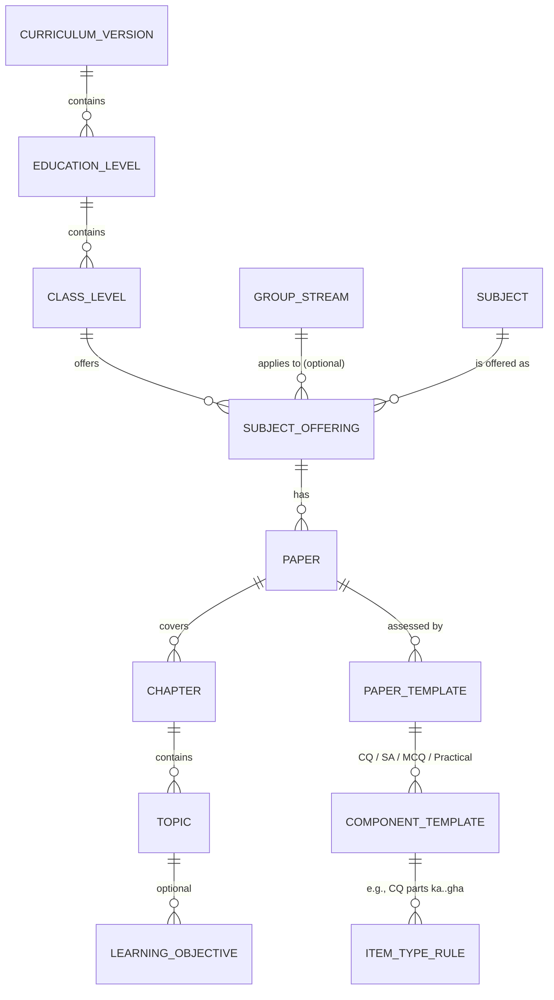

# 08 — Data Strategy, Curriculum Architecture, Security and Privacy Specification

| Field | Value |
|---|---|
| Document Name | Data, Curriculum, Security & Privacy Specification |
| Version | 1.0 |
| Status | Baseline. **Legal items depend on the Phase 0 legal opinion (EXP-10, OQ-05) and hosting decision DEC-12.** |
| Date | 2026-09-27 |
| Owner | Engineering Lead (data/security), Assessment Lead (curriculum), CEO + counsel (privacy/legal) |
| Purpose | Defines the data the product needs and how it is collected, labelled, stored, protected, retained and deleted; how curriculum is represented; and the security and privacy architecture for children's exam data in Bangladesh. |
| Source Research | S10 (data governance patterns), S09 (roles, audit), S05–S07 (security threats), V1 Q6 (PDPA 2026, Cyber Suraksha Act 2026, draft AI policy), V2 Q6 (vendor data terms); VF-01..06, VF-12, VF-13, VF-22 |
| Dependencies | `01-PRD.md` (DATA, SEC, PRV, FR-ORG-06, FR-ADM-05); `03-system-design.md` §6–8, §17; `02-TRD.md` §18–23 |

---

## 1. Data Strategy

### 1.1 Required datasets

| Dataset | Content | Source | Needed for | Phase |
|---|---|---|---|---|
| Curriculum packs | Class, group, subject, paper, chapter and topic trees (BN/EN) per academic year | NCTB textbooks and published mark distributions; platform assessment specialists | Exam setup, analytics | 0–1 |
| Paper templates | Component structures, choice rules, marks (e.g., SSC-2026 Maths/Physics) | NCTB documents (VF-03), design-partner papers | Exam setup, result engine | 0–1 |
| Rubric template library | CQ criterion templates per subject × part; answer spec patterns | Assessment specialists + design-partner teachers | Rubric authoring, AI quality | 0–1 |
| School question papers, rubrics, model answers | Per exam | Teachers (customer content) | Marking | 1+ |
| Rosters and consent | Students, sections, consent status | Schools | Operations, legality | 1+ |
| Script images | Pages per student per paper | Capture | Marking, evidence, appeals | 1+ |
| AI outputs | Regions, transcripts, criterion decisions, risk, provenance | Pipeline | Review, audit | 1+ |
| Teacher decisions and corrections | Final marks, edits, reason codes, notes | Review | Results, improvement (scoped) | 1+ |
| **Gold set (GS)** | Triple-marked, adjudicated items + double-keyed transcripts | EXP-01 with consented design-partner scripts | Gates, model selection | 0 |
| Development set (DS), challenge set (CS) | Consented scripts; curated hard cases | Design partners; volunteers | Iteration, robustness | 0+ |
| Red-team set (RT) | Constructed adversarial items | Volunteers (with consent) | Security gate | 0–1 |
| OMR set | Hand-filled bubble grids captured by phones | Internal | OMR accuracy | 0–1 |
| Live audit set (LA) | 1% of confirmed AI-suggested items blind re-marked | Consented schools only | Production monitoring | 2+ |
| Handwriting-bias set | Identical content in three legibility tiers | Volunteers | Fairness audit (06 §4.4) | 0–1 |
| Benchmarks | Frozen GS versions per release; public Bangla HTR sets (BN-HTRd, Bongabdo) used only for diagnostics | Internal + public | Regression, comparison | 0+ |
| Metering and cost | Pages, calls, tokens, cost per script | Pipeline | Billing, cost control | 1+ |

**Explicitly not collected:** national ID numbers, birth registration numbers, addresses, parents' phone numbers (unless the school enables SMS, then stored in the school's contact field only), photos of students, biometrics, religion, financial data.

### 1.2 Data collection (Phase 0 → production)

| Stage | Source | Consent basis | Volume target |
|---|---|---|---|
| Phase 0 design partners | 3–5 schools; completed annual/test exams Nov–Dec 2026 | Guardian consent (CT-1 + CT-3) specific to research/evaluation; school agreement | ≥300 scripts per subject for GS; ≥100 per subject for DS |
| Pilot | Paid pilot schools | CT-1, CT-2; CT-3 optional | Operational; LA sample from CT-3 schools |
| Production | Customers | Same | Operational |

### 1.3 Annotation operations (Phase 0)
- **Annotators:** experienced secondary subject teachers from non-participating schools, paid per hour. They sign confidentiality agreements and are trained on the rubric schema (2 h) with a calibration set of 30 items. They must reach ≥0.80 exact agreement with the reference on 1–2-mark items before starting.
- **Tasks:**
  - (a) item marking with criterion decisions (3 independent per item);
  - (b) transcription double-keying for a 100-script subset per subject;
  - (c) page and region labelling for mapping evaluation;
  - (d) legibility rating (3-point scale);
  - (e) adjudication by senior teachers.
- **Tooling:** the platform's review UI in *annotation mode* (no AI shown, per-annotator isolation). No downloads. Watermarked views.
- **Quality control:** 5% of items are re-served to the same annotator to measure intra-rater consistency. Annotators below 0.70 κ are retrained or removed.
- **Cost (Validation Required):** see 06 §4.5.

### 1.4 Data validation and quality metrics

| Dimension | Metric | Target |
|---|---|---|
| Capture completeness | Scripts captured / expected (excluding absent) | 100% before lock (blocking) |
| Capture quality | Pages passing on-device QA on first attempt | ≥90% |
| Identity | QR decode success | ≥99% (fallback: manual link) |
| Mapping | Items remapped by teachers | Monitor per cell; alert if >5% |
| Consent coverage | Students with CT-1 recorded before capture | 100% of captured |
| Roster integrity | Students without section or roll | 0 (blocking) |
| Schema validity | AI outputs valid on first attempt | ≥98% |
| Lineage | Final marks traceable to images, rubric version, suggestion provenance | 100% |
| Evaluation data | Annotator agreement per batch | Reported; adjudication for all disagreements |

### 1.5 Storage and versioning
- **Relational (PostgreSQL):** tenants, rosters, exams, rubrics (versioned rows), items, suggestions, decisions, results, audit, metering.
- **Object storage:** page images (original compressed + normalised), item crops (derived, regenerable), PDFs.
- **Evaluation data:** a separate project, bucket and database schema ("eval"). Access is limited to platform AI/assessment roles. Datasets are versioned as immutable manifests (file hashes + label versions).
- **Configuration as data:** curriculum packs, templates, prompts and model routes are versioned records with semantic versions, referenced by ID from each suggestion's provenance.

---

## 2. Curriculum Architecture (DEC-16)

### 2.1 Hierarchy



- **CurriculumVersion:** e.g., `NCTB-SEC-2012R` with `academic_year = 2026` and `status = active`. Every exam pins one.
- **EducationLevel:** Secondary (6–10), Higher Secondary (11–12).
- **ClassLevel:** 9, 10. Textbooks for 9–10 are typically combined; SubjectOffering can span 9–10 (verify per subject when building packs).
- **GroupStream:** Science, Humanities, Business, or none (common subjects) (VF-01).
- **Subject / Paper:** e.g., General Mathematics (single paper), Physics (single paper at SSC). Bilingual names.
- **Chapter / Topic:** from the textbook table of contents, per academic year (revised yearly: VF-02).
- **LearningObjective:** optional in the 2012-based curriculum; the field exists for the 2028 curriculum.
- **PaperTemplate / ComponentTemplate / ItemTypeRule:** assessment structure (below).
- **Competency (future):** a placeholder entity for the 2028 curriculum. It is linked to items when defined.

### 2.2 Assessment templates (data examples)

```json
{
  "template_id": "SSC2026-PHY-THEORY",
  "curriculum_version": "NCTB-SEC-2012R",
  "subject": "physics",
  "total_marks": 100,
  "components": [
    {"code": "CQ", "marks": 40, "choice": {"answer": 4, "of": 7}, "item_type": "CQ4PART",
     "pass_marks": null},
    {"code": "SA", "marks": 10, "choice": {"answer": 5, "of": 7}, "item_marks": 2},
    {"code": "MCQ", "marks": 25, "item_marks": 1, "capture": "cover_bubbles"},
    {"code": "PRAC", "marks": 25, "capture": "import"}
  ],
  "pass_rule": {"per_component_percent": 33, "components": ["THEORY_WRITTEN", "MCQ", "PRAC"]},
  "source": "School syllabus CPSCS 2025 + NCTB 2025-01-03 (VF-03); NCTB PDF pending verification"
}
```

```json
{
  "item_type_rule": "CQ4PART",
  "parts": [
    {"part": "ka", "label_bn": "ক", "marks": 1, "cognitive_level": "knowledge"},
    {"part": "kha", "label_bn": "খ", "marks": 2, "cognitive_level": "comprehension"},
    {"part": "ga", "label_bn": "গ", "marks": 3, "cognitive_level": "application"},
    {"part": "gha", "label_bn": "ঘ", "marks": 4, "cognitive_level": "higher_order"}
  ],
  "stimulus": "uddipok"
}
```

Component pass-rule groupings (e.g., whether CQ + SA form one "written" component for pass purposes) are **configurable per template** and must be verified against the NCTB mark-distribution documents (VF-03 notes that the PDF was not retrievable). The default follows board practice as described in V1 and is marked `verification: pending` until confirmed.

### 2.3 Handling curriculum change
- Packs are **data**. A new academic year's textbook revision creates a new pack version. Existing exams are unaffected.
- For the 2028 curriculum (VF-02), create a new CurriculumVersion with its own templates. If assessment moves toward competencies or continuous assessment, the generic item and rubric schema still applies. Competency links are added. Result rules are configurable per template.
- A new or changed item type triggers re-gating of the affected AI cells (06 §6).

---

## 3. Data Inventory, Classification and Retention (DEC-30)

The PDPA 2026 defines four classification tiers (public, internal, confidential, restricted; VF-12). The platform's tentative mapping is below. **Whether exam scripts count as "restricted" must be confirmed by the legal opinion** (OQ-05). If so, the localisation rules could apply and DEC-12 changes.

| Data | Examples | Tier (tentative) | Location | Retention | Deletion method |
|---|---|---|---|---|---|
| Student identity | Name, roll, class, section, group, version | Confidential | Identity schema (separate encryption key per tenant) | While the student is active at the school on the platform; deleted ≤90 days after contract end or on school instruction | Row delete + tenant key shredding at contract end |
| Consent records | Consent types, evidence reference, date, recorder | Confidential | Identity schema | ≥5 years after last processing (proof of lawful basis) | Delete after period |
| Staff accounts | Name, mobile, roles | Confidential | App DB | Account life + 1 year | Delete |
| Question papers, rubrics (pre-exam) | Paper content before the exam date | **Confidential, restricted-access** (leak risk) | App DB | School-owned; contract term | Delete with tenant |
| Script page images | Original and normalised pages | Confidential (legal check) | Object storage, per-tenant key | **Until marks locked + re-check window (default 180 days after publication; school-configurable 90–365)**, then deleted | Object delete + key rotation per exam bucket prefix |
| Derived crops, transcripts, AI outputs | Region crops, transcripts, criterion decisions, risk | Confidential | Object storage + app DB | Same as script images (evidence must remain available until the re-check window closes) | Delete; decisions summarised into audit |
| Final marks, results, report cards | Item marks, totals, grades | Confidential | App DB | Contract term; exported to the school on exit; deleted ≤90 days after contract end | Delete |
| Audit log | Who, what, when, before/after, reason, provenance hashes, model/prompt versions | Confidential (pseudonymous) | Append-only store | **≥5 years** (PDPA processing records; draft AI policy 5-year logs). After contract end, the identity link is destroyed (key shredding), leaving pseudonymous records | Expiry after period |
| Evaluation datasets (consented, CT-3) | De-identified crops, labels, transcripts | Confidential | Eval project | Until consent withdrawn, or 3 years (re-consent to extend) | Manifest-driven delete; models are not trained on them (DEC-13) |
| Product analytics | Events without content or identity (tenant, role, action, timings) | Internal | Analytics store | 13 months | Expiry |
| System logs | Redacted technical logs (no content, no names) | Internal | Log store | 90 days | Expiry |
| Backups | Encrypted DB snapshots | As source | Backup store | 35-day rolling | Expiry; restored data honours deletions via a replay log |
| Capture device cache | Pages awaiting upload | Confidential | Encrypted app storage | Deleted on server acknowledgement; warning at 7 days; auto-purge at 14 days if not uploaded (with operator confirmation) | Secure delete |
| External AI vendor copies | Request payloads | Confidential (de-identified) | Vendor | **ZDR where available**; otherwise per vendor abuse-monitoring terms (30 days OpenAI/Anthropic, 55 days Gemini, VF-22), disclosed in the DPA | Vendor policy |

---

## 4. Data Lifecycle Controls

```mermaid
flowchart LR
  A[Roster + consent<br/>school upload] --> B[Exam setup<br/>paper + rubric]
  B --> C[QR covers printed<br/>no names on pages]
  C --> D[Capture on device<br/>encrypted queue]
  D --> E[Upload TLS<br/>checksum]
  E --> F[Ingestion<br/>malware/type checks]
  F --> G[Identity pages isolated<br/>header masking]
  G --> H[AI processing<br/>de-identified crops only]
  H --> I[Teacher review<br/>RBAC scoped]
  I --> J[Moderation + lock]
  J --> K[Results + publication]
  K --> L[Re-check window]
  L --> M[Image deletion<br/>marks + audit retained]
  M --> N[Contract end:<br/>export → delete → key shred]
```



---

## 5. Security Specification

### 5.1 Threat model (assets and threats)

| Asset | Threat | Likelihood | Impact | Control |
|---|---|---|---|---|
| Question papers and rubrics before the exam | Leak (insider, compromised account) | M | H (national leak problem, S03/S04) | Pre-exam content visible only to the creator, HoD and coordinator; access logged; exports watermarked with the user ID; cover sheets carry no question content |
| Script images | Unauthorised viewing; exfiltration | M | H | RBAC by section; per-tenant keys; signed short-lived URLs (≤5 min); no public buckets; watermarking in the viewer |
| Marks | Tampering (insider before or after lock) | M | H | Every change audited with reason; lock + OTP; moderation; hash-chained audit; post-lock versioning |
| Accounts | Takeover (SIM swap, password reuse) | M | H | OTP on new device and sensitive actions; rate limits; lockout; session binding; admin alerts on role changes |
| Tenant data | Cross-tenant leakage | L | H | Row-level security (tenant_id); separate identity schema; CI isolation tests |
| AI pipeline | Prompt injection via handwriting | M | M | Data-only prompting, structured outputs, pattern detection, human confirmation (06 §7) |
| AI vendors | Retention or misuse of data | L | H | Paid tiers (no training); ZDR where available; de-identified crops only; DPA disclosure |
| Capture devices | Loss or theft | M | M | Encrypted storage; app PIN; remote queue wipe on account disable; no gallery export |
| Uploads | Malicious files | L | M | Type validation (JPEG/PNG/PDF only), size limits, AV scanning, image re-encoding before processing |
| Platform staff | Abuse of access | L | H | No standing access to tenant data; school-approved, time-boxed support grants; break-glass with two approvers; full logging |
| API | Abuse, scraping, DoS | M | M | Authentication on all endpoints; per-user and per-tenant rate limits; WAF/CDN; pagination limits |

### 5.2 Authentication (DEC-39)
- Staff: mobile number + password (≥10 chars, breached-password check). SMS OTP on new device, on password reset, and on sensitive actions (publish, unlock, role change, data export/delete).
- Sessions: 12 h idle timeout on web, 30 days on the capture app (device-bound refresh token, revocable).
- Optional TOTP for admins (Phase 3). No student accounts in v1.
- Platform staff: SSO with hardware-key MFA.

### 5.3 Authorisation (RBAC)
Permissions are checked at the API layer and enforced again by database row-level security (tenant, school, section scope).

| Permission | Teacher | HoD | Coord. | Principal | School Admin | Capture Op. | Platform Support (granted) |
|---|---|---|---|---|---|---|---|
| Manage school settings, roster, consent | — | — | — | — | ✔ | — | read (granted) |
| Create/edit exam (own subject) | ✔ | ✔ (subject) | ✔ (all) | — | — | — | — |
| Edit/lock rubric (own) | ✔ | ✔ (subject) | — | — | — | — | — |
| View pre-exam question content | own | subject | ✔ | — | — | — | — |
| Print covers | — | — | ✔ | — | — | — | — |
| Capture/upload/fix pages | ✔ | ✔ | ✔ | — | — | ✔ (assigned) | — |
| View scripts and AI output | assigned sections | subject | progress only (no content) by default | — | — | own captures, before upload | granted, time-boxed |
| Mark items | assigned | subject | — | — | — | — | — |
| Moderate / resolve flags | — | ✔ | — | — | — | — | — |
| Lock/unlock marks, publish (OTP) | — | — | ✔ | approve unlock (policy) | — | — | — |
| Log re-check / assign re-marker | — | ✔ | ✔ | — | — | — | — |
| School AI view | — | ✔ | ✔ | ✔ | ✔ | — | — |
| Per-teacher analytics | self | subject | per policy (OQ-18) | per policy | — | — | — |
| Audit viewer | — | subject | ✔ | ✔ | ✔ | — | — |
| Usage, billing | — | — | — | ✔ | ✔ | — | — |
| Data export/delete requests | — | — | — | — | ✔ (OTP) | — | — |

### 5.4 Other controls
- **Encryption:** TLS 1.2+ (1.3 preferred) in transit. At rest: AES-256 for the DB (managed) and object storage. **Per-tenant data keys** (envelope encryption via KMS) for images and the identity schema. Key rotation yearly and on incident.
- **Secrets:** managed secret store; no secrets in code or on devices; vendor API keys per environment; rotation 90 days.
- **Audit logging:** append-only table with a hash chain (each event stores the hash of the previous event per tenant) and daily anchoring of the chain head to write-once storage. Covers mark changes, rubric versions, locks, publishes, consent changes, role changes, data exports, support access and AI provenance references.
- **File security:** allow-list of MIME types; re-encoding of images; PDF rasterisation in a sandbox; AV scan; max 25 MB per file (PDF import: 500 MB chunked).
- **API security:** OWASP ASVS L2; input validation; output encoding; CSRF protection for web; CORS allow-list; idempotency keys for uploads; signed URLs for media.
- **Rate limiting and abuse prevention:** per user, per tenant and per IP; OTP send limits (5/hour/number); anomaly alerts for bulk exports.
- **Prompt-injection protection:** see 06 §2.4 and §7.
- **AI data security:** de-identified crops only; per-request random IDs; no tenant identifiers in prompts; vendor keys scoped per environment; payload logging disabled at vendors where possible; an internal payload archive (for audit) encrypted under the tenant key.
- **Security testing:** SAST/dependency scanning in CI; external penetration test before the pilot (G1) and yearly; red-team exercise for AI (EXP-08).
- **Legal alignment:** Cyber Suraksha (Security) Act 2026 (VF, V1 Q6). Incident handling and cooperation obligations are to be confirmed by counsel.

---

## 6. Privacy Specification

### 6.1 Roles and lawful basis
- **School = data controller** ("data fiduciary"). **Platform = processor.** AI vendors = sub-processors (listed in the DPA with location and retention).
- **Students are children (<18) → parent or legal guardian consent** (PDPA s.9; VF-12). The consent procedure regulations are not yet issued; the product implements the school-collected consent below and will adapt when regulations are published (RSK-16).
- **Consent types** (recorded per student; FR-ORG-06):

| Code | Consent | Required for | If absent |
|---|---|---|---|
| CT-1 | Digital marking: capture, storage and in-platform marking of the student's scripts | Any capture | Script is marked on paper. Marks are entered via the results module under the school's student-records basis (**legal confirmation needed**). |
| CT-2 | AI assistance, including processing by named AI service providers (possibly outside Bangladesh) under no-training terms | AI processing (L1+) | Scripts are processed at L0 (no AI calls) |
| CT-3 | Contribution of de-identified scripts and marks to evaluation and quality improvement (no model training in v1) | Inclusion in DS/CS/LA/GS | Excluded from all datasets |

- Consent texts are in Bangla and English, plain language, with purpose, recipients (including AI vendors and their countries), retention, rights, and a withdrawal route. The legal opinion (EXP-10) must approve them.
- **Withdrawal:** CT-2 withdrawal stops future AI processing, and AI outputs for pending items are deleted within 24 h. CT-3 withdrawal removes the student's items from datasets at the next manifest rebuild (≤30 days).

### 6.2 Data minimisation and pseudonymisation
- No names on answer pages (DEC-14). Scripts are linked via a random script UUID in the QR code.
- Identity pages (QR cover, booklet front cover) are **never sent to external AI**. School-configured header strips are masked on inner pages.
- Transcripts are scanned for roster names (fuzzy match). Matches are redacted in stored transcripts and flagged.
- **This is pseudonymisation, not anonymisation.** Handwriting and content can still identify a student, so all script data is treated as personal data (correcting S10's overstated "fully de-identified" claim).

### 6.3 Access by teachers and administrators
- Teachers see only their assigned sections' scripts; HoDs see their subject.
- Coordinators see progress and marks, not script images, unless they are also a teacher of that section or are handling a re-check.
- Administrators manage identity and consent but do not see scripts.
- Platform staff have no standing access (§5.3).

### 6.4 Third-party model exposure (DEC-12, VF-22)

| What is sent | What is never sent |
|---|---|
| Answer-region images or masked answer pages; rubric, model answer, alternatives; item metadata (marks, type, language); random request IDs | Cover sheets, booklet covers, names, rolls, school names, student or script IDs, teacher names, consent data |

**Vendor requirements:**
- paid API tiers with no training on customer data;
- ZDR where offered (request it for all vendors);
- a documented retention period;
- a DPA/processor terms;
- incident notification;
- sub-processor listing.

**Vendors are selected only if these terms are met** (06 §3, "data terms" weight 10%).

### 6.5 DPIA (before the pilot)
The DPIA must cover:
- processing description and necessity;
- the children's data risk assessment;
- cross-border transfer analysis (PDPA s.29);
- AI-specific risks (errors, bias, automation bias; mitigations in 06/07);
- automated-decision analysis (there are no solely automated decisions: every mark is human-confirmed);
- retention;
- security;
- rights handling;
- vendor assessment;
- residual risk sign-off by the CEO and the school's representative for pilots.

It also serves as the "Algorithmic Impact Assessment" expected by the draft AI policy for high-risk education AI (VF-13).

### 6.6 Data subject rights (via the school)
- **Access:** the school exports the student's marks, result slips and (within retention) script images.
- **Correction:** marks go through the re-check flow; identity is corrected by the admin.
- **Deletion:** FR-ADM-05. Exceptions are stated: audit records within the 5-year period, and marks the school must retain.
- **Objection to automated decisions:** not applicable in the strict sense (a human confirms every mark). The right to a human re-mark without AI is always available (DEC-23).
- **Response time:** acknowledged within 7 days, completed within 30 days (pending regulations).

### 6.7 Breach response
- Detect → contain → assess.
- Notify affected schools **without undue delay, target ≤72 h** after confirmation.
- Support the school's notification to the Authority and to guardians as required by the PDPA (timelines pending regulations).
- Post-incident review.

### 6.8 Hosting (DEC-12, DECISION REQUIRED)
- Recommended: a regional hyperscaler region for the application and storage, with a containerised, portable core (PostgreSQL, S3-compatible storage) deployable to a Bangladeshi data centre if the legal opinion or regulations require it.
- **The pilot does not start until the legal opinion confirms the hosting and cross-border model.**

---

## 7. Multi-tenancy (summary; architecture in `03` §6)

Hierarchy: **Platform → Organisation → School → Academic Year → Class → Section → Student.** Branch, shift and version are attributes, not tiers (DEC-38).

Isolation:
- `tenant_id` (the organisation) on every row, with row-level security;
- a separate encryption key per organisation;
- object keys prefixed by tenant;
- tenant-scoped caches;
- AI requests carry no tenant identity;
- knowledge artefacts (clarifications, rules, libraries) are tenant-scoped (07 §5.1).
